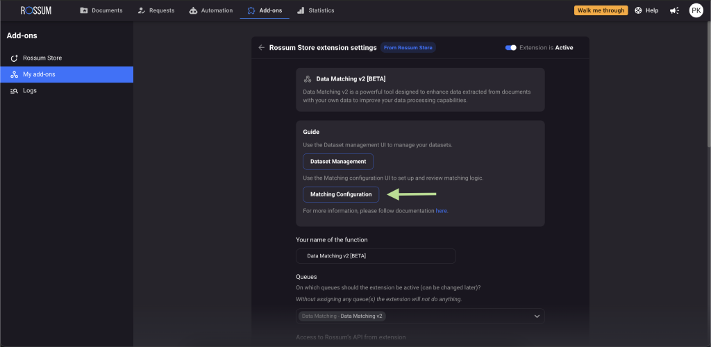
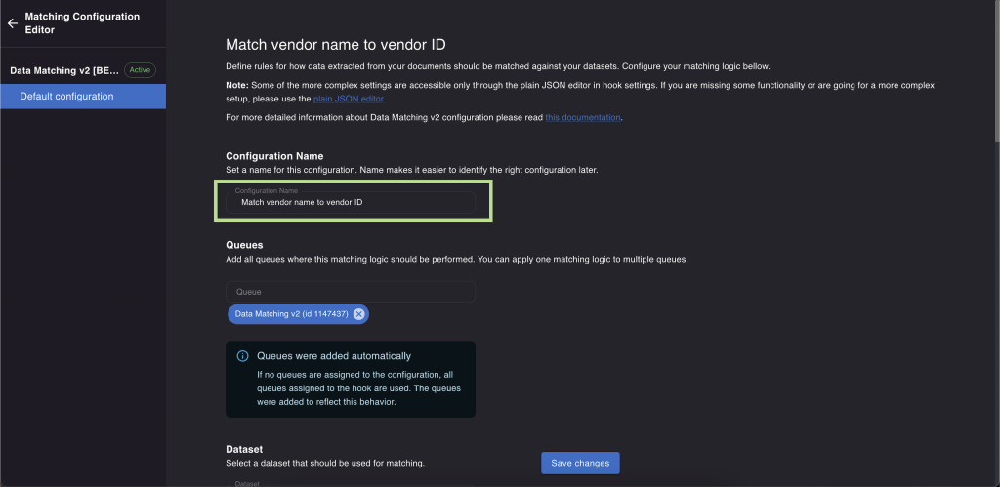
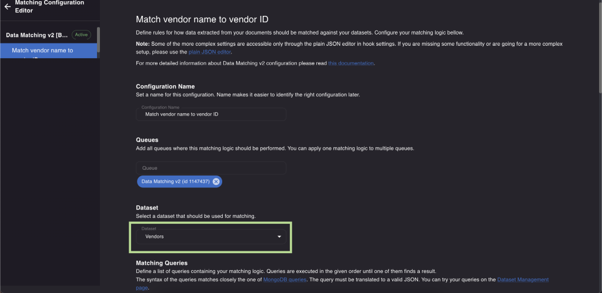
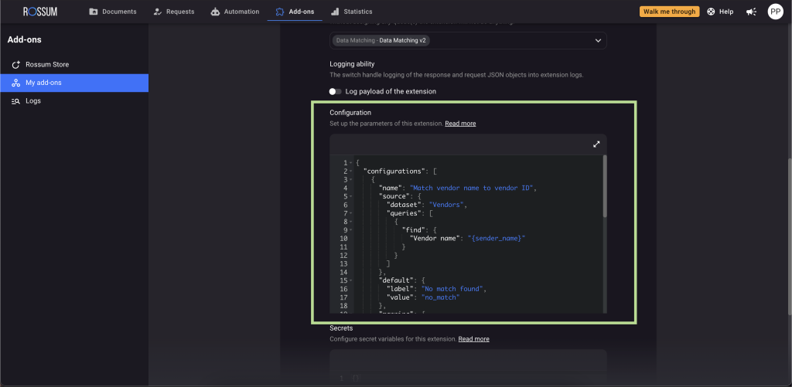

## How to set up matching configuration

In the "Matching Configuration" part of the extension, you can set up the rules for how data matching works.



Start with assigning a name to your configuration. This will help you identify it later.



Link the queues to which you would like to apply the configuration. You can apply the same matching logic to multiple queues. The queues added in "Rossum Store Extension Settings" will be automatically included here. If you want the rules to apply only to specific queues, you can make a selection.


In the next step select the dataset you want to use for matching.



Prepare your matching queries. Queries are executed in the given order until they find a result - that means queries after the one that returned a result are not executed. They use MongoDB syntax - [documentation can be found here](https://www.mongodb.com/docs/manual/tutorial/query-documents/). The query must be translated into valid JSON. You can try out your queries on the Dataset Management page.


In the next step, specify how you want to display the results using:

- "Target Schema ID" - to show the schema ID of the field where the matched result will be kept
- "Dataset Key" - to choose which attribute from the dataset should the extension return if a match is found (such as Vendor ID).
- "Label" to define the data and its format that you want to show as a value in the target field. If you don't specify a "Label", the extension will display the value from the Dataset Key.


Choose a default value and its label to be placed in the target annotation field. Can be used for example if no matches are found.


Configure the "Result Actions". These actions determine what should happen when zero, one, or multiple matches are found in the dataset based on the specified queries. Use the "Action" field to define the value that will be displayed to the user in different situations.


Additionally, you can set up a message that will accompany the displayed result. An "error" message type will halt the automation and prevent annotators from manually confirming the document until the value is added. "Warning" and "info" messages will display the information, but automation will continue and annotators will be able to manually confirm the document.

As a final step, save your configuration. All the changes made in the "Matching configuration" tab will be reflected in the "Configuration" section of the extension. You can also use that field to define the rules.



## How to set up exact matching

Exact data matching means that the value extracted from the document has to match the value from your dataset completely. To make this work, you can use simple 'find' queries. To understand this better, let's look at the example we [discussed earlier](./dataset-management.md).

### Query 1: Finding a vendor record using extracted vendor name

Query:

```json
{ "find": { "Vendor name": "{sender_name}" } }
```

The query checks the "Vendor name" in the dataset and compares it to the value of the "Vendor name" field extracted from the document. To refer to the "Vendor name" field, we used its schema ID - `sender_name`.

In the configuration section we also defined that the value returned from the dataset in case the match is found will be "Vendor ID" (in "Dataset key").

Based on these rules, the extension found an exact match and returned Vendor ID that is now visible in Rossum and stored in the matching enum field.


### Query 2: Finding a vendor record using extracted vendor VAT number

Query:

```json
{ "find": { "vatNumber": "{sender_vat}" } }
```

This query checks "vatNumber" in the dataset and compares it to the value of extracted vendor VAT number that is referenced here by schema ID of the field that holds extracted vendor VAT number in Rossum - "sender_vat".

To learn more about the Master Data Hub configuration visit [Configuration Examples](./configuration-examples.md).

## How to set up fuzzy matching

The example we discussed covers the basic exact matching where the data needs to match completely. However, our extension offers more options and flexibility. It allows you to create complex rules and use fuzzy matching to match similar values within a certain range of error. Please note that this advanced feature is not yet available in the user interface and would require assistance from our team.

To learn more about the Master Data Hub configuration visit [Configuration Examples](./configuration-examples.md).

## How multiple matching configurations work

You have the flexibility to set up multiple configurations, and each configuration can have multiple queries within it. These configurations are executed in the specific order - from top to bottom as shown both in the UI and JSON.

Within each configuration, the queries are also processed in the top to bottom order. However, if a query produces a result, any subsequent queries won't be triggered.

These configurations pass the values from one to the next. For example, suppose the Vendor matching configuration is the first in the configuration list. If it finds a Vendor ID and stores it in a field called "vendor_match", you can use this "vendor_match" value in the next matching configuration. The value obtained from the previous query will be immediately available for use.
