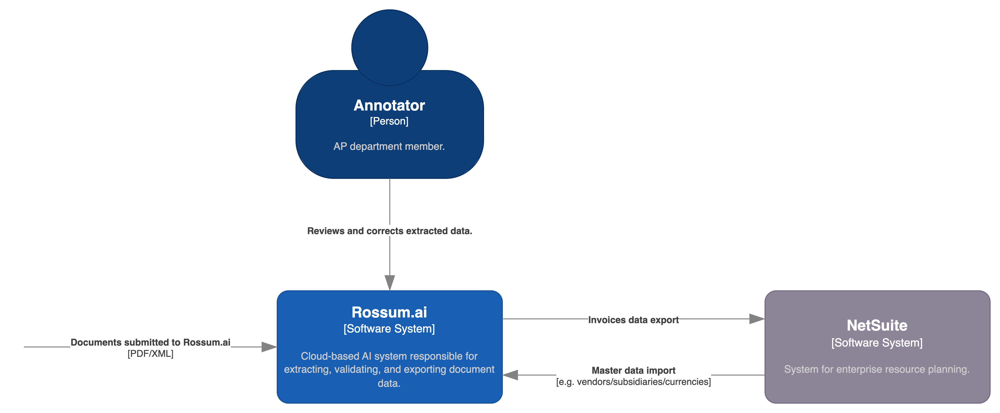

import WebhookEndpoints from '../\_webhook_endpoints.md';

## Installation

NetSuite service (integration) is provided by Rossum.ai in the form of webhook. To start using NetSuite (either imports or exports), follow these steps:

1. Login to your Rossum account.
1. Navigate to **Extensions → My extensions**.
1. Click on **Create extension**.
1. Fill the following fields:
   1. Name: `SB1 NetSuite: Import/Export`
   1. Trigger events: `Manual` (later also `Scheduled`)
   1. Extension type: `Webhook`
   1. URL (see below)
1. Click **Create the webhook**.
1. Fill `Configuration` and `Secrets` fields (see [Integration Configuration](./integration-configuration.md) and [Import configuration](./import-configuration.md) or [Export configuration](./export-configuration.md).

### Import endpoints

<WebhookEndpoints
  eu1="https://elis.rossum.ai/svc/netsuite-v3/api/v1/import"
  eu2="https://shared-eu2.rossum.app/svc/netsuite-v3/api/v1/import"
  us="https://us.app.rossum.ai/svc/netsuite-v3/api/v1/import"
/>

### Export endpoints

<WebhookEndpoints
  eu1="https://elis.rossum.ai/svc/netsuite-v3/api/v1/export"
  eu2="https://shared-eu2.rossum.app/svc/netsuite-v3/api/v1/export"
  us="https://us.app.rossum.ai/svc/netsuite-v3/api/v1/export"
/>

## Basic usage

:::warning[Work in progress]

_Describe how to quickly use the extension._

:::

## Available configuration options

:::warning[Work in progress]

_Describe all relevant configuration options._

:::

## System context diagram

## Useful links

NetSuite main navigation can sometimes be very confusing as it is very customizable. Use the following paths to quickly access NetSuite resources:

- Accounts: [`/app/accounting/account/accounts.nl`](https://system.netsuite.com/app/accounting/account/accounts.nl)
- Currencies: [`/app/common/multicurrency/currencylist.nl`](https://system.netsuite.com/app/common/multicurrency/currencylist.nl)
- File Cabinet [`/app/common/media/mediaitemfolders.nl`](https://system.netsuite.com/app/common/media/mediaitemfolders.nl)
- Items: [`/app/common/item/itemlist.nl`](https://system.netsuite.com/app/common/item/itemlist.nl)
- Purchase Orders: [`/app/accounting/transactions/purchordermanager.nl?type=proc`](https://system.netsuite.com/app/accounting/transactions/purchordermanager.nl?type=proc)
- Subsidiaries: [`/app/common/otherlists/subsidiarylist.nl`](https://system.netsuite.com/app/common/otherlists/subsidiarylist.nl)
- Vendor Bills: [`/app/accounting/transactions/transactionlist.nl?Transaction_TYPE=VendBill`](https://system.netsuite.com/app/accounting/transactions/transactionlist.nl?Transaction_TYPE=VendBill)
- Vendor Credits: [`/app/accounting/transactions/transactionlist.nl?Transaction_TYPE=VendCred`](https://system.netsuite.com/app/accounting/transactions/transactionlist.nl?Transaction_TYPE=VendCred)
- Vendors: [`/app/common/entity/vendorlist.nl`](https://system.netsuite.com/app/common/entity/vendorlist.nl)
