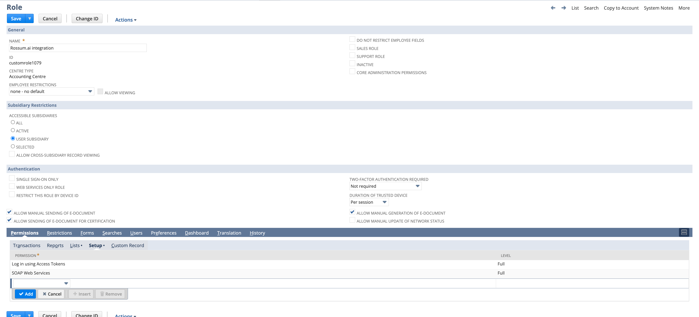

# Integration configuration

To configure an access token in NetSuite for SOAP communication, especially when there is no integration user yet, involves several steps that include creating an integration record in NetSuite, setting up a role with the necessary permissions, creating an integration user, and then generating the access token. Below is a step-by-step guide:

## 1. Create an Integration Record in NetSuite

1. **Log in to your NetSuite account** as an administrator (https://system.netsuite.com/).
1. Navigate to **Setup > Integrations > Manage Integrations > New**.
1. Fill in the **Name** of the integration and ensure that **State** is enabled.
1. Check the **Token-Based Authentication** to use token-based auth along with SOAP.
1. **Save** the integration. Note the **Consumer Key** and **Consumer Secret** presented upon saving; these are important for authentication.


## 2. Create a Role with necessary permissions

1. Navigate to **Setup > Users/Roles > Manage Roles > New**.
1. Provide a **Name** for the role and assign it permissions necessary for the operations the integration will perform. At a minimum, for SOAP communication, you might need permissions like **SOAP Web Services, Log in using Access Tokens**, and any specific permissions related to the data you wish to access or modify (Lists).
1. **Save** the role.



## 3. Create an Integration User

1. Go to **Lists > Employees > Employees > New**.
1. Fill in the necessary information for the user. Under the **Access** tab, ensure you **Check** the **Give Access** option, set a **Password**, and **Assign the Role** you created earlier.
1. **Save** the employee record.

## 4. Generate the Access Token

1. Log in as the user who will be the integration user, or have them log in.
1. Navigate to **Setup > Users/Roles > Access Tokens > New**.
1. Select the **Application Name** (the integration you created in Step 1), the **User**, and the **Role** you've assigned to this integration.
1. **Save** to generate the Token ID and Token Secret.

## 5. Use the Access Token in SOAP communication

With the Consumer Key, Consumer Secret, Token ID, and Token Secret, you can now configure Rossum.ai SOAP client for communication with NetSuite:

Secrets:

```json
{
  "consumer_key": "…", // change
  "consumer_secret": "…", // change
  "token_key": "…", // change
  "token_secret": "…", // change
  "rossum_username": "system.user@rossum.example", // change
  "rossum_password": "…" // change
}
```

Import/Export configuration:

```json
{
  "netsuite_settings": {
    "account": "XXX_SB1", // Case sensitive!
    "concurrency_limit": 4,
    "wsdl_url": "https://XXX-sb1.suitetalk.api.netsuite.com/wsdl/v2024_1_0/netsuite.wsdl",
    "service_url": "https://XXX-sb1.suitetalk.api.netsuite.com/services/NetSuitePort_2024_1",
    "service_binding_name": "{urn:platform_2024_1.webservices.netsuite.com}NetSuiteBinding"
  }
}
```

Account ID (`account`) can be found under **Setup > Company > Company Information**.

## Important notes

- Ensure your NetSuite account has the **Token-Based Authentication** feature enabled. This can be checked and enabled under **Setup > Company > Enable Features > SuiteCloud**.
- The permissions assigned to the role will dictate what operations can be performed through the SOAP API. Make sure to adjust these according to the least privilege principle, granting only the permissions necessary for the tasks the integration will perform.

This process sets up a secure method for your application or integration to communicate with NetSuite using SOAP. If you encounter any specific issues during setup or need more detailed instructions, NetSuite's official documentation and support resources can provide additional guidance tailored to the latest platform updates and best practices.
