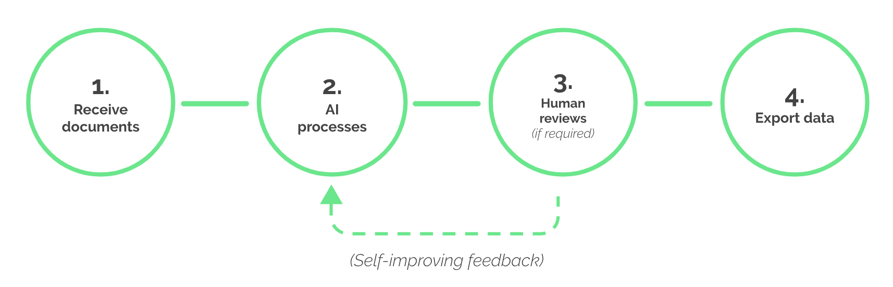

This page will give you the first feel about Rossum. You'll be up and running in a jiffy!

Rossum is a [cognitive data capture](https://rossum.ai/help/faq/what-is-cognitive-data-capture/) platform for information extraction from business documents. It consists of four main components: the **AI Core Engine** that can automatically detect data fields, the **Validation Interface** for data verification, correction and training, the **Extension Environment** that allows custom business rules to be plugged in and applications built around Rossum, and the **Reporting Engine** for process analysis and efficiency improvements.

The key to understanding how Rossum works is understanding the flow of document through the platform. Documents are received first, then pre-processed using the AI engine, then available for review and eventually the captured data are exported to downstream systems. Documents flow within potentially multiple _queues_ – they separate documents handled differently, and each queue can be configured to capture different set of datapoints (so-called _schema_).

In terms of states, during a typical [document lifecycle](https://rossum.ai/help/article/document-lifecycle-a-guide-to-the-document-statuses/), the documents are **imported** first, then transition through the **to review** state, and usually end up in the **exported** state – at that point, the capture data may be downloaded, or an extension was already notified and the data were pushed to it. If something goes wrong, documents may of course end up in error states, or deleted or postponed.

There are multiple ways to integrate Rossum in your particular process, ranging from simple to powerful:

- **Manual integration** with files uploaded manually or via email, and captured data downloaded as XML or spreadsheet manually as well and imported to an ERP.
- **[Zapier](./integrate-rossum-with-zapier) integration** that automates integration over the internet (ideal for integration with modern cloud services) by using simple graphical workflows ("Zaps") and no programming required.
- **RPA integration** that automates integration on the OS level (ideal for integration with on-premise systems using their graphical user interfaces) by using an RPA workflow such as a UiPath-based one.
- **Programmatic API integration** that runs as a separate service interacting with Rossum – it can apply business rules, import and get notified about finalized documents, and even customize the validation interface with interactive functionality such as dynamic supplier matching.

We also call the programmatic API integration **[Rossum Extensions](https://developers.rossum.ai/docs/extensions-overview)**. They can either call the Rossum API, or get called by Rossum pro-actively. The ability for anyone to implement and run their own extension is crucial for us at Rossum, as it allows true customization to a particular need.

Start experimenting with integrating Rossum right away! [Create a fresh trial account here.](https://elis.rossum.ai/registration)
