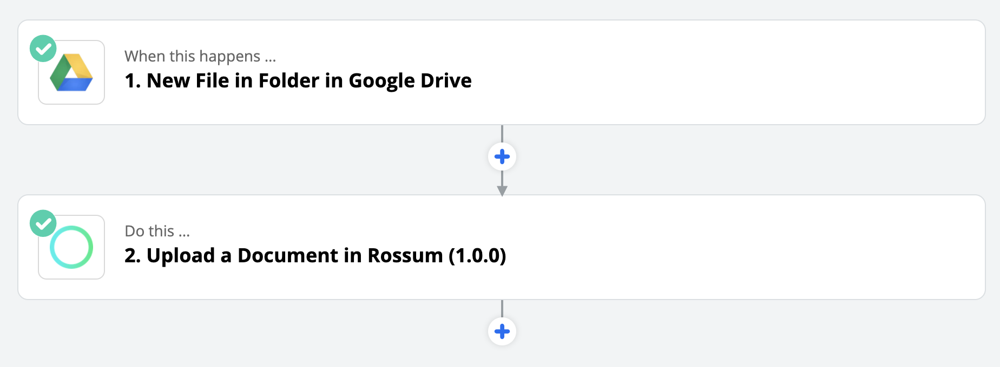
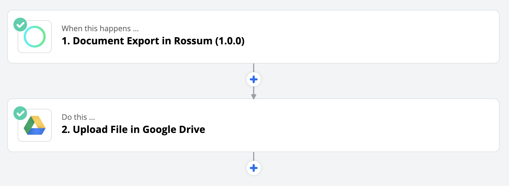
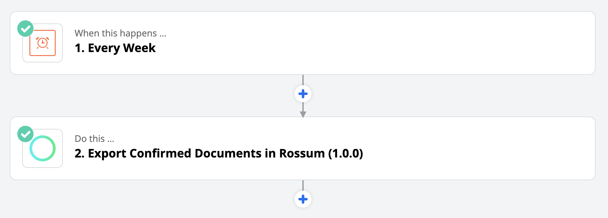

[Zapier](https://zapier.com/) is a UI-based integration platform, that enables you to connect actions from various applications into simple pipelines called Zaps. Zaps are composed of "Triggers" and "Actions".

Below is an example of a simple Zap, which is triggered when a file is added to a particular folder in your Google Drive. The resulting action is that file being uploaded to a queue in Rossum.

In this guide, we'll go through Triggers and Actions of Rossum app and we will demonstrate their usage by building common use-case Zaps. Before we do that, make sure you have [an account on Zapier](https://zapier.com/sign-up/) and that Zapier [supports an application](https://zapier.com/apps/integrations) you use. It can be anything from [Xero Accounting Software](https://zapier.com/apps/xero/integrations) to [eBay](https://zapier.com/apps/ebay/integrations).

When setting up an integration, you should first think briefly about what's the best way to actually use Rossum in your workflow - [we recommend you batch-review your documents all at once in Rossum](../rossum-in-a-document-pipeline.md), rather than one by one.

## Overview of Rossum Triggers and Actions

In this guide, we'll create a Zap for each of the below. From there you can [build an integration](https://rossum.ai/integrations/) between your favorite application and Rossum.

## Upload a Document Action

Zaps can serve to automate [manual document uploads](https://developers.rossum.ai/docs/getting-files-in-rossum). This action is pretty straightforward. All you need is a trigger that outputs a file and you can start uploading documents (PDFs and Images) to Rossum. [(Read more about the upload Zap.)](./upload-a-document-to-rossum-using-zapier.md)

## Document Export Trigger

Once a document is exported in Rossum, this trigger can run a Zap dedicated to propagation of captured data for the individual document back to your system. Captured data can be output either as a file (in a format supported by our [export API](https://api.elis.rossum.ai/docs/#export-annotations)) or the data can be exposed in the Zap to allow post-processing. [(Read more about the export Zap.)](https://developers.rossum.ai/docs/document-export-from-rossum-using-zapier)

## Export Confirmed Documents Action

It is often easier to [export data from many documents at once](https://developers.rossum.ai/docs/getting-data-from-rossum). If you have [confirmed state](https://rossum.ai/help/article/batch-export-confirmed-tab/) enabled on your queue, you can use this action to trigger batch export of all documents pending in "Confirmed" tab. Zap with this action is designed to be paired with a Zap with **Document Export Trigger**. [(Read more about the batch export Zap.)](https://developers.rossum.ai/docs/batch-export-of-documents-from-rossum-using-zapier)

