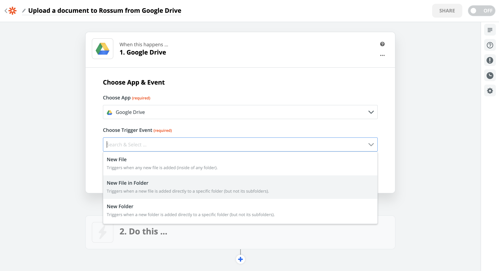
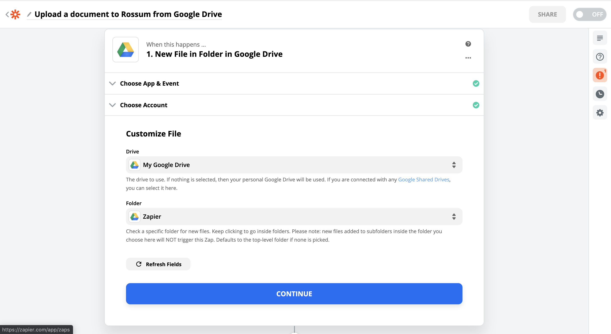
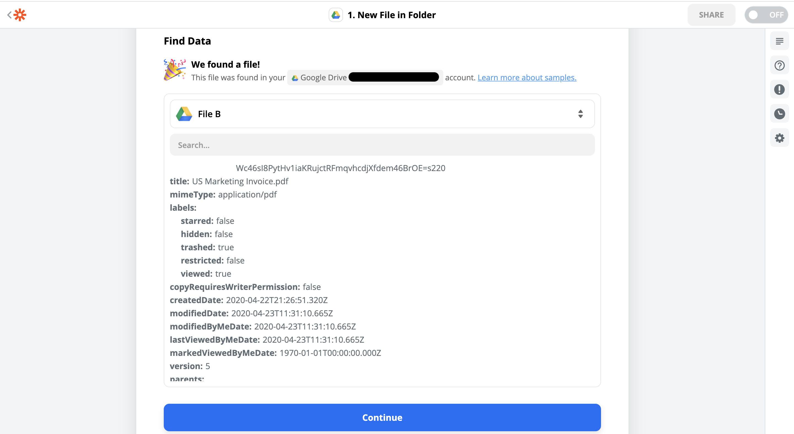
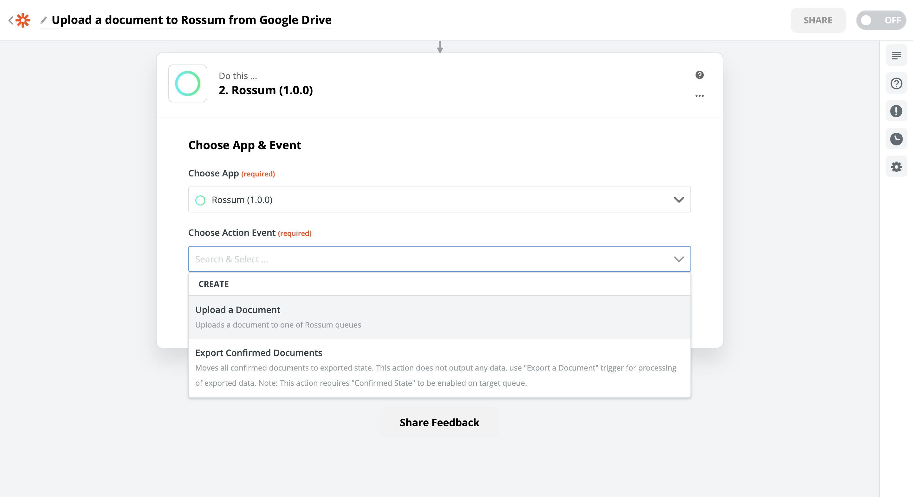
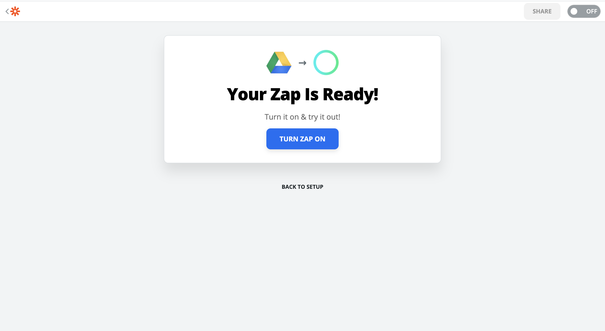

In this guide, we'll create a Zap that is triggered each time you upload a file to a specific folder in your Google Drive and uploads it to one of your Rossum queues.

## Step 1: Create a new Zap

After you've created [an account in Zapier](https://zapier.com/sign-up/) go to [Zap editor](https://zapier.com/app/editor/) to create a new Zap. Since "Upload a Document" is an action, we need to set up our trigger first. Search for the app that should provide the trigger and select it. In our case it's Google Drive.

## Step 2: Set up a Trigger

Select a Trigger Event, in our case, it's "New File in Folder". Each app has a different set of Triggers and the set up is a little different for each of them. But the overall workflow is the same.

The next step usually requires you to sign in to the app. In our case, we provide credentials to Google account.

In the next setup section for this trigger, we specify the drive and the folder that should register new uploads.

## Step 3: Test the trigger

The final section of any setup (both for triggers and action) is testing. This step checks if the trigger was configured properly and conducts a test run, which will generate output data. The output of this step is important, as it will dictate what data will be shown during the configuration of our next Zap step.

In our case, we select File B, which is an Invoice (PDF) stored in our actual drive. Great! Let's continue to the real meat of this Zap.

## Step 4: Set up the Rossum "Upload a Document" action

In the next Zap step, we select the Rossum app and the "Upload a Document" action.

Again, the next step is concerned with authentication. This time we sign in with the credentials we use to log in to [Rossum app](https://elis.rossum.ai).

In the **Customize Document** section, there are 3 fields.

- **Queue** field is a dropdown, where you can select one of your queues. It's this queue, where we will be uploading files to.
- In **File** field we want to reference the output of the Google Drive trigger. You can search among output fields of the previous step through a convenient dropdown. Select a field which has _(Exists but not shown)_, it indicates that there is a raw file data in there.
- **Title** including the extension. We want this to be dynamic (for each Zap run different) as well, so we want to select one of the Trigger output fields here too.

## Step 5: Test the "Upload a Document" action

Just like with the trigger, even this step needs to be tested. Here you can also see the output of the upload call. It can be further passed down to another action, in case you wanted to add 3rd step to this Zap. For example, you could send an email informing a reviewer, there's a document in Rossum ready for his review.

> 🚧 Test run will actually upload the document
>
> Once you click the test button, the Zap will be legitimately called with the data you were using during its setup. A file will be [uploaded to Rossum](https://developers.rossum.ai/docs/getting-files-in-rossum). [(Read more about document file requirements in Rossum.)](https://developers.rossum.ai/docs/document-import-specification)

## Step 6: Victory

Now, all we need to do is to turn this Zap on. It's worth mentioning that some Triggers are **instant** and some can have a delay based on your Zapier plan. Be sure to check which kind you are using to avoid confusion, that your trigger is not working.

For basic Zapier plans, non-instant Triggers are called once in every 15 minutes.

