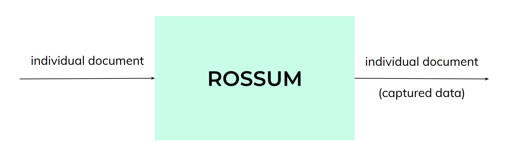
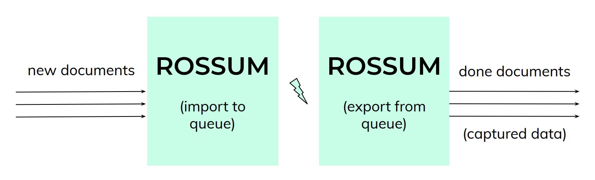

When deciding [how to integrate Rossum](https://rossum.ai/blog/elis-integration-three-ways/), an important question is how to fit Rossum into the flow of documents to be processed. When and how to import documents, have a human review them and then export them to downstream systems? Do it one by one or in a batch?

The matter is pretty simple in a manual integration scenario – documents are coming into Rossum ad hoc, processed at the operator's leisure (typically en masse when enough of them accumulate) and then the captured data is exported from each queue, typically corresponding to a certain time range.

However, in a programmatic scenario, you have a more explicit choice – to think either in terms of _documents_, or to think in terms of a _document flow_. Let's take a more detailed look.

## One-by-one Processing

The first thought when implementing Rossum might be to process documents one by one. Each document is tracked individually: uploaded, its _id_ is acquired, monitored for processing progress by periodical polling, then the data is downloaded and taken for further processing.

:::note

There is no single API endpoint to process a document. The API is asynchronous, therefore you do need to use one call to upload the document, then repeatedly refresh the status, and ultimately download the captured data by a separate final call.

:::

This approach is certainly possible, especially with smaller volumes. This is the model presented for example by the **[elisctl](https://github.com/rossumai/elisctl) document extract** command. Readers fluent in Python may even [look at the actual code](https://github.com/rossumai/elisctl/blob/master/elisctl/document/extract_data.py).

However, this approach is a poor fit in many scenarios. First, it does not serve well with non-trivial volumes. Rossum takes a while to process every document (though we aim to process 90% of documents under 5 minutes in typical circumstances) and the engine optimized for highly parallel processing – loading and simultaneously processing a large volume of documents. Processing documents one by one will therefore be simply inefficient. And when multiple documents are individually tracked in parallel, that quickly puts a big strain on resources.

## Batch Processing

Let's think bigger – rather than obsessing about documents as individual units, consider the continuous flow of documents. This is a perfect fit for Rossum's _queue_ concept. Every document is imported to a queue, and all captured data is exported from a queue.

From this perspective, tracking every nuance about a single document isn't so important. What is important is that documents safely get into a queue, and then that whichever captured data is ready is read back from the queue. The set of data fields is still associated with the original file, so nothing gets mixed up. But the key question asked changes from _what is the status of my document_ to _what data is ready for further processing_.

This is actually the easiest Rossum integration to implement. Simply import documents at your leisure (either individually as they arrive, or gathered in batches) and let your users operate the web interface at their convenience. Then, at a periodical interval, captured data are exported from the queue and batch-processed by the downstream system.

This really gives your process a regular rhythm and is the ideal fit also for RPA scenarios. See our [integration whitepaper](https://rossum.ai/files/Rossum_Whitepaper_PartnerIntegration.pdf) for a practical example of an RPA workflow built around this scheme. And Computer Science connoisseurs might recognize the _source – sink_ or _scatter – gather_ paradigms in this viewpoint.

## Push Notifications

Now, as you get further into integrating Rossum using its extension mechanism, a new way opens that clears all the downsides of the individual document view – push notifications. Documents may be imported at your leisure, but rather than actively tracking a status of each document on the downstream side, Rossum may send push notifications (through its [webhook API](https://api.elis.rossum.ai/docs/#webhook-extension)) with final set of captured data for every individual documents. This can be then actioned upon by importing the data to a downstream system right away, for example.

A similar case is when using the [embedded mode](https://api.elis.rossum.ai/docs/#embedded-mode) where the web app is not used as a whole. Instead, just the validation interface is invoked on individual documents from an external application. The best of both worlds, in this case, is to monitor the queue as a whole to get information about which documents are ready (or [use the status change webhook](https://api.elis.rossum.ai/docs/#webhook-extension)) so that your users know they can open them in Rossum already.
