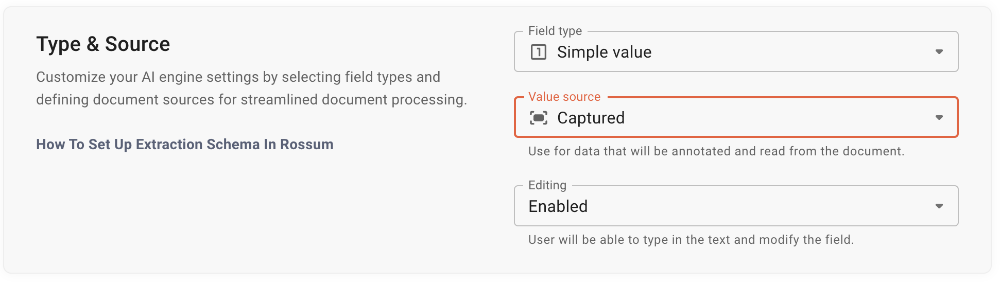

Rossum's AI-powered document processing doesn't need complex templates to be built for each vendor layout to be able to predict where the values should be.

What the AI needs is precise and consistent data which we can get from User feedback - annotations.

Annotations refer to all the captured data from a document. You can recognize them by the blue bounding boxes (b-boxes) that appear on the document after it is processed in Rossum.

Please review these resources before starting:

- [Annotations Guide](https://rossum.ai/help/article/annotations-guide-and-rules-to-follow/)
- [Interactive Bounding Boxes](https://rossum.ai/help/article/interactive-bounding-boxes-in-rossum/)

:::info

When you first start using our product, it may not be clear what triggers AI learning. You upload your documents and apply corrections, but when will you start seeing improvements? It's simple. Every document must be `confirmed` or `exported`, depending on your settings. The entity confirming the document must be a real person, not an automated process or external script. Depending on your AI engine, you will be able to see changes in newly uploaded documents either immediately or after an agreed-upon time.

:::

## 🚀 Three key concepts to maintain good AI performance {#three-key-concepts-to-maintain-good-ai-performance}

### Precision

1. Check that [bounding boxes](https://rossum.ai/help/article/interactive-bounding-boxes-in-rossum/) are correctly applied to the value.
   - No overlapping with another bounding box.
   - The value is captured fully.

### Accuracy

1. If value is placed in the wrong field, correct it.
2. If there are typos or other issues, try adjusting the bounding box to get the correct reading.

### Consistency

1. If you have multiple values in a document, it is recommended to always select them from the same position. This is especially important when working with similar or identical layouts. Sometimes, it may be difficult to remember how you annotated a similar document. In such cases, you may want to consult previously confirmed documents or use the following rules to help maintain consistency.

   - Prefer values that appear earlier in the document.
   - If multiple values can fit, choose the one that is closer to the header part of the document.
   - If multiple values fit but are scattered across multiple pages, choose the one that is closest to the first page (or on the first page if possible).
   - If the value usually accompanies other fields' values, choose the location that is close to these other fields' values.
     In case multiple values are on the same level (on the right and left of the bottom of the document) just decide to go always closer to the right side of the document.

2. Capture all and only the values in the documents.

   - If there is data in the document that has a corresponding field in the schema for extraction, capture it in each document where it is present, even if you may not need it to be extracted for a particular vendor or in a particular case.
   - Amounts should also always be captured, even if the value on the document is "0".
   - Conversely, if a value is not present on the invoice, please do not enter it manually.

For in detail explanation please reach out to [Annotations Guide](https://rossum.ai/help/article/annotations-guide-and-rules-to-follow/).

## 🛟 Common issues {#common-issues}

1. The AI has predicted the correct value, but the reading of the text is incorrect

   - Re-adjust the Bounding Box so that the OCR is applied again
   - If, after a couple of attempts the value is not corrected, change the value manually

2. The AI has predicted the correct value, but only partially or included extra text

   - Correct the position of the Bounding Box so that it goes around the correct data
   - The learning is then stored & will be applied to later annotations

3. The date format is read incorrectly

   - The date format is pre-defined by the schema
   - The interpretation of ambiguous dates relies the document region that is set for the queue
   - Re-adjust the bounding box or ask your Admin to adjust the field to the correct date format, if the formatting is consistently not correct

## 🤔 Considerations {#considerations}

1. Always try to annotate text for names. Avoid logos or visual representations of data.
2. Handwritten data is not currently supported, even though it may be partially recognized.
3. Watermark recognition is not currently supported. If your use case requires this functionality, please contact a Rossum representative for further assistance.

## 🏆 Priority of rules {#priority-of-rules}

It may happen that some of the recommendations contradict each other in particular cases.

- The principles of Precision and Accuracy should take priority.
- When applying the Consistency principle, be reasonable. For example, if there is a logo at the top of the first page and a written sender name in the footer of the document, choose the footer, even if the recommendation is to prefer the header.
- Another example is when two values always appear together in the footer, but one of them is also present in the header section (e.g., Sender Name and Sender Address). In this case, you can choose to annotate both together in the footer, but be consistent and do not occasionally switch to another location. In the end, consistency itself is more important

## 🙋 Q&A {#qa}

### When should I use multiple queues for my documents?

Different queues should be used if there is a different set of fields to capture from the documents (e.g., if in one case you are capturing tables, and in another, you are not, the documents should be separated into different queues).

:::tip

✅ One queue - no need to separate: You have `Document X` with line items and `Document Y` without line items. You capture line items in `Document X` and skip them in `Document Y`. You can have one queue because you train the AI to capture line items where they are present and do not attempt to capture them where they do not exist. This way, you differentiate various layouts and achieve better training.

⛔ Two queues are required: You have `Document Z` and `Document W`. Both have line items. You capture line items in `Document Z`, and for some reason, you do not want to spend time correcting/extracting line items from `Document W`. Then, you can't have one unified queue for data capture. Load these documents in two different queues to maximize extraction performance.

⛔ Multiple queues are required when you have small overlaps in the extracted fields across different document types.

:::

Documents in unique scripts should be in separate queues (e.g., documents in Latin script should be in one queue, and documents in Cyrillic script in another).

Documents from different regions should also be sent to separate queues to ensure correct date and number parsing.

### How can I correct inaccurate annotations to improve AI predictions?

If you have manually processed a document and later discovered mistakes in the annotations, you can correct them to prevent the AI from repeating these errors.

#### Using Export for documents

If the document has already been exported, you will need to return it to the "Review" status. To change the document's status to "Review", simply select the document and move it to the same queue without re-extracting the data, this action will keep the document in the same queue and change the status. Then, correct the data points and export it again.

#### Using Confirmed status

If you are using the "Confirmed" status without exporting, you can open the document in this status and make the necessary edits. Once the changes are made, confirm it again.

:::info

Depending on your version of the AI engine, changes may affect predictions either immediately or after an agreed-upon period. For more information, please contact Rossum.

:::

:::danger

Always make sure you fully understand the consequences of re-confirming or re-exporting a document.

Ensure that exporting again or making changes to a confirmed document does not cause complications with integrations or existing business logic.
For example, if you have an integration with a downstream system triggered every time you export data, re-exporting may cause duplicates or errors in that system.

:::

### The field does not learn from annotations

1. Check your version of the AI engine. While one version learns almost instantly, another requires some agreed-upon time to pick up confirmed or exported documents. If you are unsure which AI engine you are using, you can review that on the page `Automation > Automation settings` and in the grid is a column with used technology. In case you are very unsure contact a Rossum representative.
2. Ensure that you are teaching the AI to extract data into a field that is supposed to capture data directly from the document, never use one that is calculated or matched from another data source. 
   A common example is fields used for matching data from a document with another data source. These fields use programmatic logic, not AI. If you want to modify the logic of this matching, contact your development team or consult a Rossum representative.
3. Ensure that the field has the correct "Value Source." For AI-driven extraction, the "Value Source" must be set to "Captured." You can find this setting in the "Queue Settings -> Fields" section.
   
   Any other type of "Value Source" will prevent AI learning.
4. For "Captured" fields, ensure that a representative set of annotated documents has been confirmed or exported.

If none of the above steps help, contact a Rossum representative.

### The field does not capture more than one line of data

If you are using a custom field to capture multiple lines of data, please consult a Rossum representative. By default, the AI learns from a single line, except for out-of-the-box address fields.

### Magic Grid disappeared for some annotations

Please check if the new option for annotating tables, [Aurora for Complex Tables](https://rossum.ai/help/article/aurora-for-complex-tables/), is available. If not, contact your Rossum representative for further assistance.

The reason the Grid may not be fully or partially displayed is due to a shift in technology towards more advanced AI recognition that no longer requires the grid. For example, if some data points in your table are nested under others, the system may be unable to create a reliable grid, as multiple fields may appear in a single column. In such cases, the grid will not be shown.

Aurora for Complex Tables avoids these issues since it does not use a grid. However, the annotation process is different, so be sure to familiarize yourself with the best practices.

### Some pre-trained fields strip characters during data extraction

Certain pre-trained fields are modified when extracted. You can learn more about pre-trained fields in our [documentation](https://elis.rossum.ai/api/docs/#identifiers).

Below is a list of fields that undergo modification (please refer to the documentation for the most up-to-date information):

| Attr. rir_field_names | Field label          | Modification                                 |
| --------------------- | -------------------- | -------------------------------------------- |
| `account_num`         | Bank Account         | Whitespaces are stripped                     |
| `var_sym`             | Variable symbol      | Possible non-numeric characters are stripped |
| `customer_id`         | Customer Number      | Whitespaces are stripped                     |
| `document_id`         | Document Identifier  | Whitespaces are stripped                     |
| `order_id`            | Order Number         | Whitespaces are stripped                     |
| `recipient_dic`       | Recipient Tax Number | Whitespaces are stripped                     |
| `recipient_ic`        | Recipient Company ID | Possible non-numeric characters are stripped |
| `sender_dic`          | Supplier Tax Number  | Whitespaces are stripped                     |
| `sender_ic`           | Supplier Company ID  | Possible non-numeric characters are stripped |

If you need to prevent these modifications, please contact a Rossum representative.
