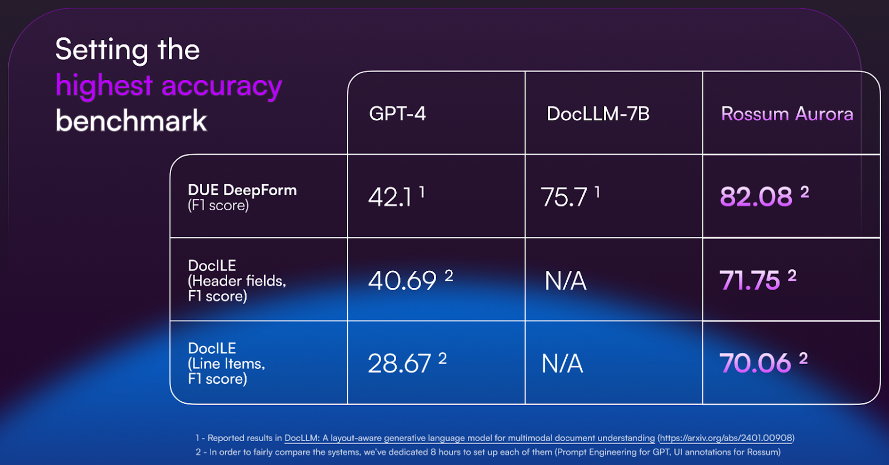
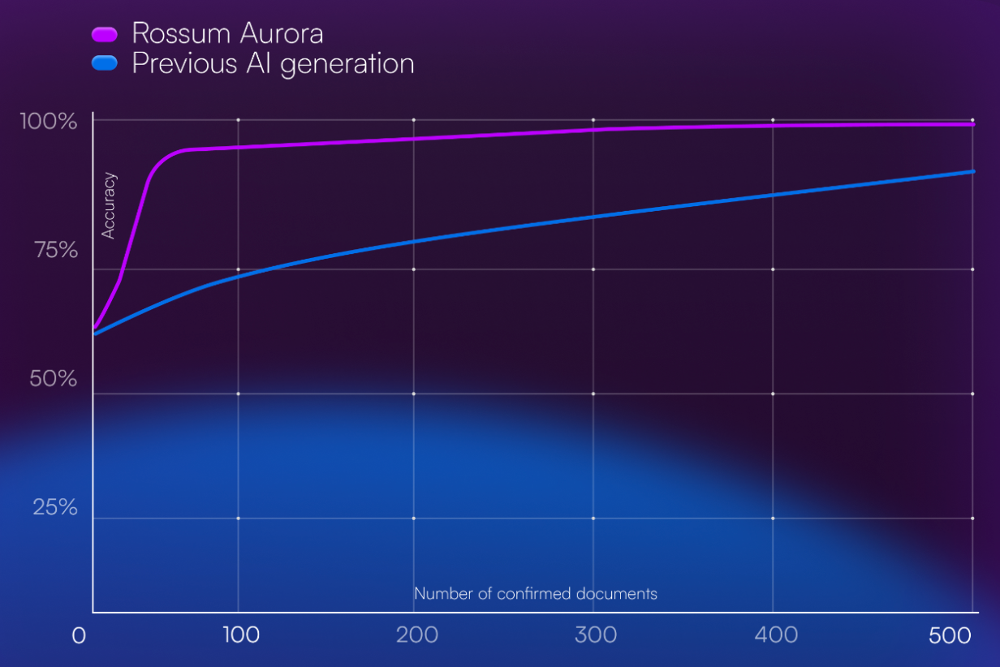

# Rossum Aurora

Aurora is an umbrella term for our state-of-the-art AI, launched in February 2024. It refers to our proprietary Transactional Large Language Model (T-LLM) that is trained on millions of transactional documents from a number of use cases and industries. The T-LLM is used as the basis for all customer/use case specific Aurora models.

T-LLM comes with a set of pre-trained fields. When you create a new queue in Rossum, you can leverage these fields for out of the box extraction. Most of the pre-trained fields are related to the Accounts Payable and Receivable use case. Aurora models don’t require regular retraining. They learn continuously from each document that is processed (user-confirmed) in the queue.

## What makes Rossum Aurora unique?

### The largest dataset on the market

Our T-LLM is trained on 100’s of millions of transactional documents with rich annotations.

### Accuracy and confidence scores

Each field is marked with a confidence score that allows users to navigate quickly to fields requiring review. Automation of a document can be controlled by setting field-level thresholds.

### Speed of learning

10x fewer training examples needed to reach the desired accuracy.

### No hallucinations

Generative models carry some notable risks, such as hallucinations, prompt injection, or data leakage.

To address these concerns, we employ a discriminative decoder that operates within the confines of the input document. This decoder ensures that the generated answers stay within the boundaries of the existing information and provides confidence levels crucial for trustworthy automation.

### Specific for transactional documents

Transactional documents such as invoices or orders have a rich visual structure where information is not in long sentences but scattered all over the page.

Conventional LLMs have been trained on continuous texts or optimized to take pictures and scenes as visual input. Instead, our T-LLMs have been optimized for semi-structured documents and are focused on both text and layout information.

### Global Language Support

276 languages fully supported, with instant learning across different languages.
30 languages are supported with handwriting.

## How is Rossum Aurora trained?

The T-LLM foundation model and the Aurora Engine are shared across all of the customers. Those are trained periodically by Rossum. The data used for the retraining is restricted to documents Rossum received a permission to use.

The Custom AI layer is trained continuously. Every `confirmed` or `exported` document contributes to the knowledge of the model. By default, the knowledge is restricted to a queue. This means that to maintain and benefit from past knowledge, the documents have to stay in the queue. Deletion and purge of `confirmed`/`exported` documents from the queue removes the knowledge from the AI database.

### Document Splitting and Classification

The AI that allows Rossum to split and classify the documents is trained as a separate model. It uses the whole text of a document to predict the type of a document and the beginning and end of documents in a single bundle.

## Best Practices

### How to separate documents into queues?

The AI is linked to the schema of fields you would like to extract. That means that all the documents in one queue have to comply with the same schema.
From this it can be inferred that each queue has to be limited to the same document type (e.g. AWB, Commercial Invoice, etc). Moreover, if the fields you want to extract from the same document type differ per region, use case or customer, it is advisable not to mix those in one queue.

:::info

If one use case requires line items and another does not, you would put documents for each use case into separate queues. If you mix them together and on some documents annotate line items and on others ignore them, the AI knowledge will be confused and AI predictions will perform poorly.

:::

Rossum now supports languages in many different scripts and theoretically should work across languages even if mixed together in one queue. Our experience is that separating queues per language script produces superior results. Note that there is no need to separate languages that use the same script (e.g. Latin).

#### Schema best practices

Schema is a list of fields that you will use to process the documents. There are 4 different kinds of fields:

- `Captured` - the values for these fields are predicted by Aurora AI. The AI learns from the values that you capture in these fields. To ensure the best performance, please follow the best practices for annotations (see next section).
- `Data` - the values for these fields are populated from the Master Data Hub, the upload window, or other extensions.
- `Manual` - these fields are there for users to manually type in values and they are not linked to any data source.
- `Formula` - these fields allow you to create formulas to set field values, whether it’s for normalizing data, performing calculations, or doing text operations.

When setting up the schema in your Rossum Aurora queue, please make sure to:

- Always set the correct value source (`captured`, `data`, `manual`, or `formula`)
- Don't change the schema ID after the team started processing the documents (annotations are connected to the IDs, and if the IDs are changed, the predictions will stop appearing until the AI learns which values you want to capture in the specific field)
- Set up fields for the individual datapoints to be captured from your documents
- If you want to utilize the pre-trained fields, do not change any of the IDs. You can change the label. Do not use the pre-trained field IDs for other fields.

#### AI training best practices

To provide AI with the best possible knowledge, please refer to our [AI training best practices annotation guide](./index.md)
