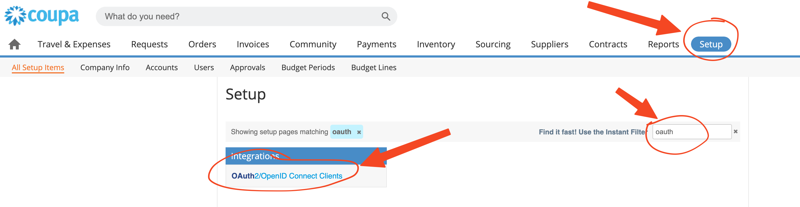
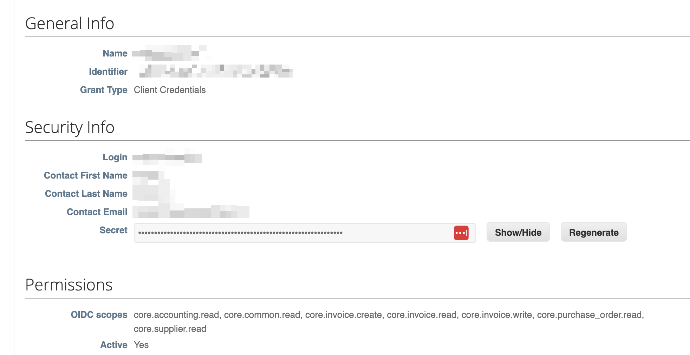
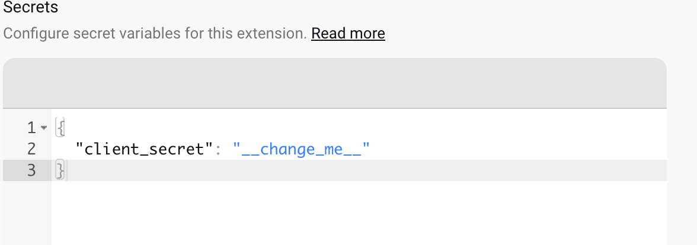
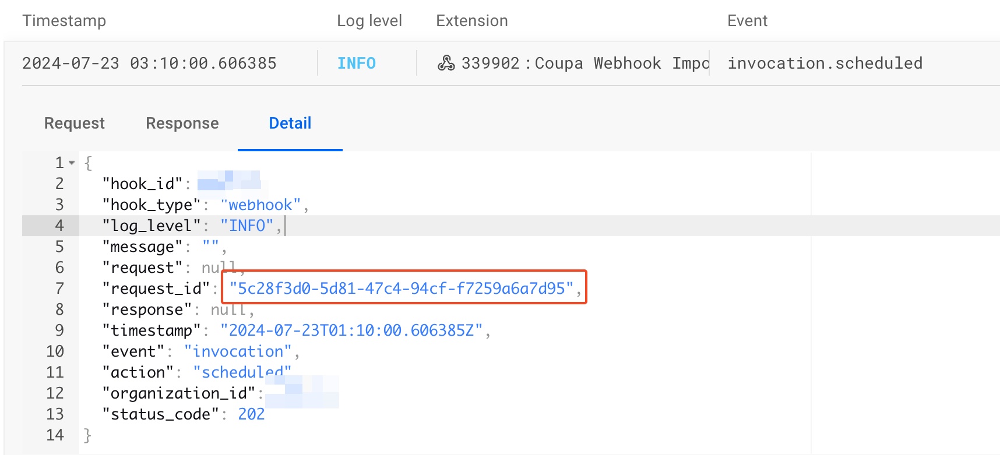
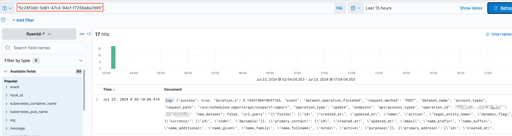

## 1. Coupa part

The main prerequisite is to have a valid Coupa user with needed permissions (see [OAuth 2.0 scopes](./coupa-oauth-scopes.md)). If you don't have a user with needed permission, ask your admin to create it.

:::tip

You can always (also) check the official documentation [OAuth 2.0 Getting Started with Coupa API](https://compass.coupa.com/en-us/products/core-platform/integration-playbooks-and-resources/integration-knowledge-articles/oauth-2.0-getting-started-with-coupa-api)

:::

1. Login to the Coupa web admin at URL `https://[example-company].coupacloud.com`
2. Go to the Setup, search for keyword `oauth` and click the one result **OAuth2/OpenID Connect Clients**


3. Find the user prepared for the integration and note the values `Identifier` and `Secrets`. You will need it for every hook setup later



4. For the start, this scopes should works for basic integration `core.accounting.read, core.common.read, core.invoice.create, core.invoice.read, core.invoice.write, core.purchase_order.read, core.supplier.read` - you can copy and paste it exactly like this when using the Postman collection provided by Coupa

## 2. Rossum part

Coupa service (integration) is provided by Rossum.ai in the form of webhook. To start using Coupa (either imports or exports), follow these steps:

### Webhook in UI
1. Login to your Rossum account.
1. Navigate to **Extensions → My extensions**.
1. Click on **Create extension**.
1. Fill the following fields:
   1. Name: `Coupa: Import/Export [what]`
   1. Trigger events: `Manual` (later also `Scheduled`)
   1. Extension type: `Webhook`
   1. URL (see below)
1. Click **Create the webhook**.
1. Fill `Configuration` (see [Import Examples](./coupa-import-configuration-examples.md) or [Export Examples](./coupa-export-configuration-examples.md)) 
1. (Optional): if you have access to the "Django", you can update secret schema so it will be easily updated. See the JSON snippet below
1. Fill `Secrets` fields. 

### Hook secret schema
```json
{
  "type": "object",
  "properties": {
    "client_secret": {
      "type": "string",
      "description": "API OAuth Client secret"
    }
  },
  "additionalProperties": false
}
```

As a result of this change, it is somehow easy to update `client_secret`




### Patch token lifetime
Patch the token lifetime to 2 minutes

```bash
curl --location --request PATCH 'https://[company-example].rossum.app/api/v1/hooks/[hook-id]' \
--header 'Authorization: Bearer [token] \
--header 'Content-Type: application/json' \
--data '{"token_lifetime_s": 120}'
```

## Initial test

You can invoke the webhook manually using **curl** (for example):

```bash
curl --location --request POST 'https://[company-example].rossum.app/api/v1/hooks/[hook-id]/invoke' \
--header 'Authorization: token [token]' \
--data ''
```

Then go to the Rossum Extension Logs and observe the content

## Debugging

When the Extension logs don't provide enough information for the proper debugging, it is needed to lookup the ES for logs using corresponding `request_id` (taken from the Extensions logs).



x

## Available configuration options

:::warning[Work in progress]

_Describe all relevant configuration options._

:::
