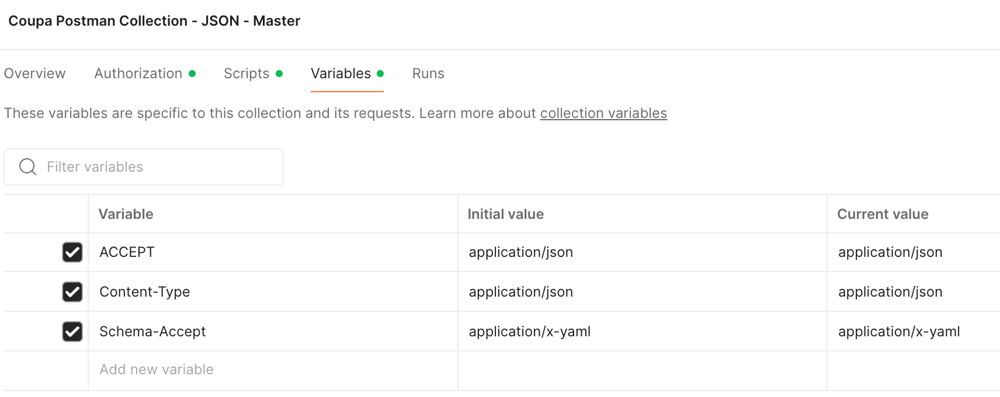
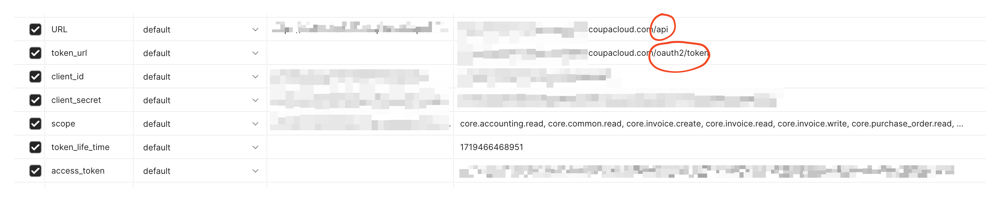

## Source

:::info
Download the Postman collection from here:

-  https://compass.coupa.com/en-us/products/core-platform/integration-playbooks-and-resources/integration-knowledge-articles/postman-collection-for-coupa-apis

:::

## Usage
Although it is possible to setup it differently, using the provided collection has some benefits built-in:

- You can copy and paste the OAuth scopes "as is" (including commas)
- The secrets handling and rotation is also included in the "Pre-req" script

Best practices

- Do not store credentials directly in the variables, use Environment instead
- The field it is required you to fill are:
  - `URL`
  - `client_id`
  - `client_secret`
  - `scope`

(Do not fill the `token_life_time` or `access_token`. It is not necessary to create these variables at all, the "Pre-req" script will create it and handle automatically.)

## Working example

### Variables

### Environment

