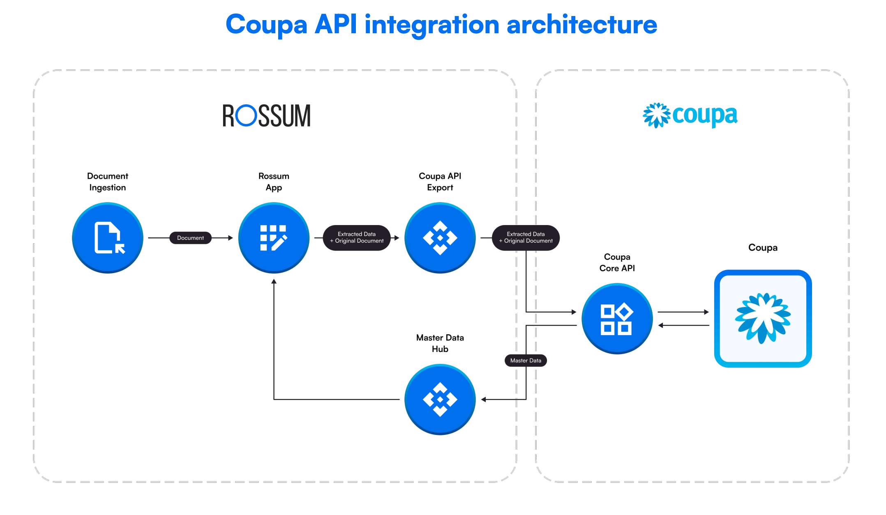

:::warning

This Coupa section is about a new **Coupa API Integration**, not the older SFTP based one **Coupa Integration Service**.

:::

## Coupa API Integration architecture

## Usage

1. First of all, you need to [setup the integration](./integration-setup.md) with Coupa
2. Then you probably want to create some [imports](./import-configuration.md)
3. Setup **Data Matching** (TBD)
4. Setup **Business Rules** (TBD)
5. After that there is a right time to also setup [exports](./export-configuration.md)
6. It is always good to know, which [OAuth 2.0](./oauth-scopes.md) is needed for corresponding API call
7. For initial testing or debugging the Coupa API, the [Postman Colection](./postman-collection.md) will be usefull
8. We have also a nice example of [Workflow with Coupa](./workflow-example.md)
