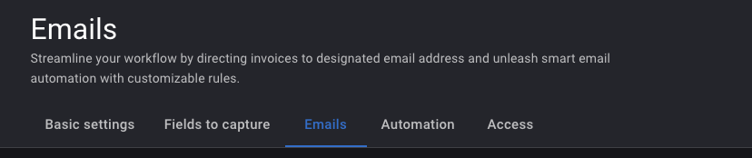
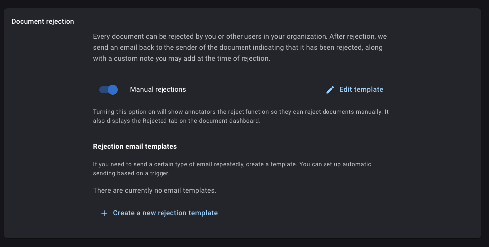
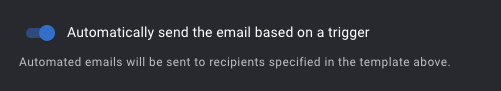
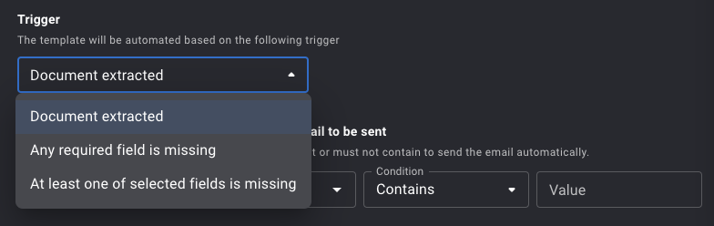
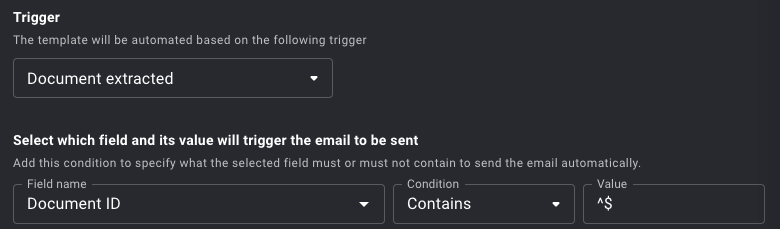

# Automating emails

## Automatic rejection based on condition

Rossum allows you to define a condition (_trigger_) and an _email template_ to be sent when the condition is true. In case the template is of type "rejection", this also sets the annotation's status to be `rejected`. This can be used to inform your vendors (or anyone else you specify in the email template) about a problematic document:

First, go to queue settings where you want to set up automatic rejections, specifically into the "Emails" section:

Scroll down to "Document rejection":

Create a new rejection template. If you would like to send automated emails to your vendors, you can use the variable `{{sender_email}}` (assuming the vendor sent the email into Rossum).

Toggle the automatic sending based on a trigger:

And finally, select the condition you want from the list (for details):

:::tip

For rejecting documents with missing fields, both the "required field missing" and "selected fields missing" triggers require a very high AI engine confidence (0.95) that the field is not on the document. However, you can also the following trigger that is checking for an empty value (by using a regex):

:::
