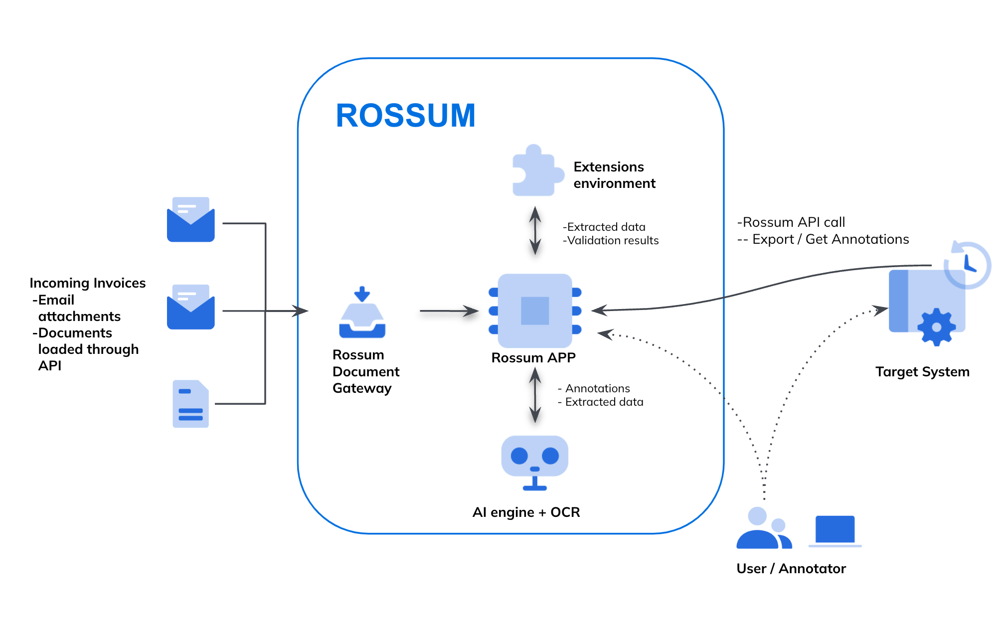
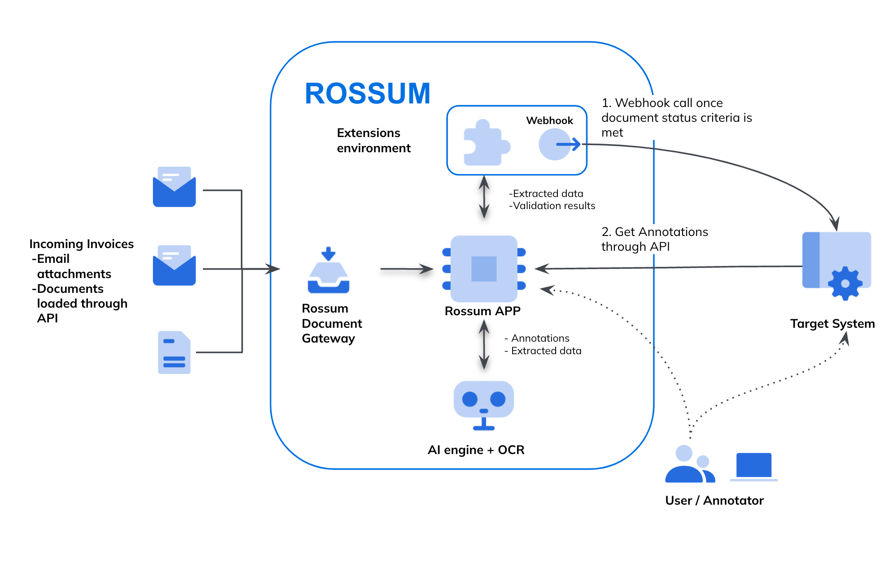
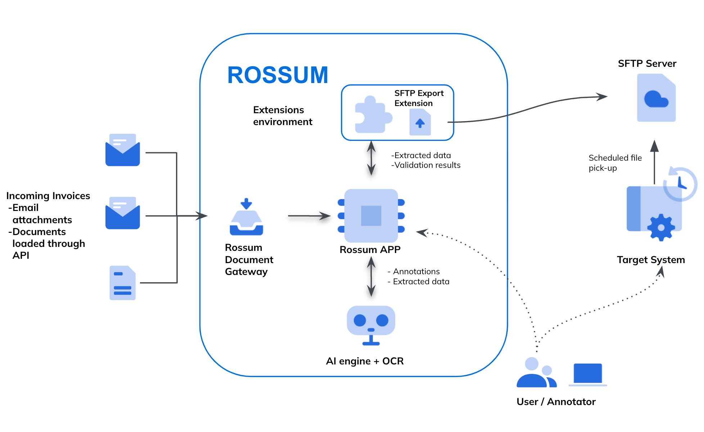

Integrating systems efficiently is critical for seamless data exchange and workflow automation. When working with the Rossum API, various integration patterns can be employed to suit different technical requirements and business needs. In this article, we explore five key integration methods—each with its own pros and cons—to help you determine the best approach for your system.

# Supported Integration Patterns
## 1. Scheduled Polling Integration
In this model, the target system schedules regular queries to the Rossum API to retrieve annotations that are ready for export.
Pros:
Full control over query frequency, error handling, and resource management.
Cons:
No real-time updates.
Requires tracking loaded annotations (Rossum’s “Confirmed” to “Exported” statuses help with this).
Hosting computational resources is necessary to run these scheduled queries.

## 2. Webhook-Driven Integration
Here, the target system listens for real-time notifications via Rossum’s Webhook. When a notification is received, the system queries the Rossum API to retrieve the annotation data.

Pros:
Real-time updates.
Ability to respond dynamically to status changes, customizing actions based on business logic.
Webhook setup is straightforward, requiring just a target URL and specified triggers.
Cons:
Requires readiness to handle incoming webhook data.
Even after receiving the notification, an API query is still necessary to retrieve the full annotation (except for certain event types that include annotation data).

## 3. Direct Push Integration (Option #1)
Rossum’s serverless function pushes data directly to the target system’s public endpoint, eliminating the need for the system to pull data.

Pros:
Real-time updates.
Flexibility to push data to any public endpoint.
No external hosting required, as Rossum provides the serverless function for integration development.
Cons:

The target system must be capable of receiving requests.
Development is needed within Rossum, which requires knowledge of Python or Node.js.
.png)
## 4. Direct Push Integration (Option #2)
In this variation, Rossum’s Webhook delivers a direct push of data to the target system.

Pros:
Real-time updates.
Rossum provides the Webhook integration out of the box.
Cons:

The system must be able to handle incoming requests.
Not all events deliver annotation data.
Limited customization of the Webhook logic, as it is offered "as-is."
.png)
## 5. File-Based Integration
With this method, Rossum exports documents to an SFTP server, and the target system retrieves the files based on its internal logic.
Pros:
Simple setup process in Rossum.
Cons:
Must track new vs. old documents.
Potential latency due to the polling interval by the target system.

## Conclusion
Selecting the right integration pattern depends on your business’s real-time data needs, technical capabilities, and the resources available. Webhook-driven and direct push integrations offer the benefit of immediate updates, while scheduled polling and file-based integrations provide flexibility and simplicity at the cost of real-time responsiveness. By weighing the pros and cons of each approach, you can build a more efficient and tailored integration strategy with Rossum.