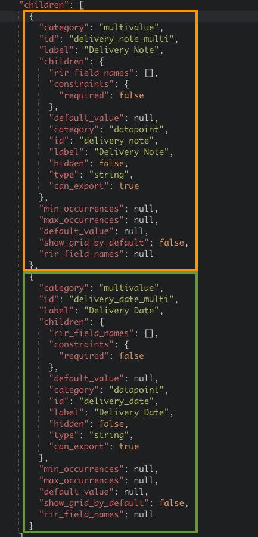

import WebhookEndpoints from '../\_webhook_endpoints.md';
import WIP from '../\_wip.md';

**Distributive webhook** extension allows for distribution of header-level or multiple-lines-level fields to respective line items. This is handy when some values appear only once per multiple lines.

## Distributive Webhook extension

Distribution of values to line items is provided as a service by Rossum.ai in the form of a webhook. To start using the extension, follow these steps:

1. Login to your Rossum account.
1. Navigate to **Extensions → My extensions**.
1. Click on **Create extension**.
1. Fill the following fields:
   1. Name: `Distributive Webhook`
   1. Trigger events: `Document content: Initialize, Updated`
   1. Queues where the extension should be executed
   1. Extension type: `Webhook`
   1. URL (see [Available endpoints](#available-endpoints) below)
   1. Under Advanced settings find Additional notification metadata and enable `Schemas` and `Queues`
1. Click **Create the webhook**.

### Available endpoints

<WebhookEndpoints
  eu1="https://elis.rossum.ai/svc/distributive/validate"
  eu2="https://{your domain}.rossum.app/svc/distributive/validate"
  us="https://us.app.rossum.ai/svc/distributive/validate"
  jp="https://shared-jp.app.rossum.ai/svc/distributive/validate"
/>

## Add the fields to schema

The distributive webhook needs the following fields:

1. Multi-value field for extracting the header-level or multi-line-level fields - source of the distribution
1. Line item field - target of the distribution



## Configure the queue

The source and target fields of the distribution are configured in each queue metadata:

1. Make sure the queue is selected in the distributive webhook extension
1. Save the configuration into the queue metadata - you need to use the [API](https://elis.rossum.ai/api/docs/#queue)

### Configuration example

The configuration follows this format:

```json
{
  "distributive_fields": {
    "{line items table schema ID}": {
      "{line item field (target) schema ID}": {
        "schema_ids": [
            "{multivalue field's child (source) schema ID}"
        ]
      }
    }
  }
}
```

For the sample schema above, the configuration would look like this:

```json
{
  "distributive_fields": {
    "line_items": {
      "item_delivery_note": {
        "schema_ids": [
          "delivery_note"
        ]
      },
      "item_delivery_date": {
        "schema_ids": [
          "delivery_date"
        ]
      }
    }
  }
}
```

### Change the Direction of Distribution

The default direction of the distribution is downwards, to the rows below the value.

For cases when the value should be distributed to the rows above it (instead of the ones below), it is possible to specify the preferred direction.

```json {8,9}
{
  "distributive_fields": {
    "line_items": {
      "item_delivery_note": {
        "schema_ids": [
          "delivery_note"
        ],
        "preferred_direction": "upwards",
        "preferred_direction_only": true
      }
    }
  }
}
```


