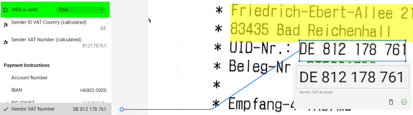

# Configuration examples

The following examples are showing commonly used configurations of the Rossum.ai Master Data Hub matching. All of these examples are typically nested in the following config:

```json
{
  "configurations": [
    {
      "name": "…",
      "source": {
        "dataset": "PurchaseOrder_v1",
        // highlight-start
        "queries": [
          // COPY-PASTE THE EXAMPLES HERE
        ],
        // highlight-end
      },
      "default": { … },
      "mapping": { … },
      "result_actions": { … }
    }
  ]
}
```

In most of the cases, the `dataset` key will be static. It can however be dynamic as well:

```json
{
  "configurations": [
    {
      "name": "…",
      "source": {
        "dataset": "PurchaseOrder_{queue_country}_v1"
        // …
      }
    }
  ]
}
```

## Best match with default fallback initial match returns no records

The following example selects a first record (the best match) if the first `$match` query returns any results and keeps empty (`""`) record on second position in the dropdown list. If the first `$match` query returns no results, it selects the empty (`""`) default record and appends all records returned by the last `$unionWith` query.

It essentially allows using `best_match` strategy in all circumstances—i.e., confident and non-confident matching in a single query.

```json
{
  "aggregate": [
    {
      "$match": {
        "Workday_Project_ID": "{item_project}"
      }
    },
    {
      "$setWindowFields": {
        "output": {
          "mainMatch": {
            "$count": {}
          }
        }
      }
    },
    {
      "$unionWith": {
        "coll": "nonexistentcollection",
        "pipeline": [
          {
            "$documents": [
              {
                "Name": "Please select",
                "mainMatch": 0,
                "Workday_Project_ID": ""
              }
            ]
          }
        ]
      }
    },
    {
      "$setWindowFields": {
        "output": {
          "mainMatchWithDefault": {
            "$count": {}
          }
        }
      }
    },
    {
      "$match": {
        "$expr": {
          "$cond": {
            "if": {
              "$and": [
                {
                  "$gt": ["$mainMatchWithDefault", "$mainMatch"]
                },
                {
                  "$gt": ["$mainMatchWithDefault", 1]
                }
              ]
            },
            "else": {
              "$eq": [1, 1]
            },
            "then": {
              "$ne": ["$mainMatch", 0]
            }
          }
        }
      }
    },
    {
      "$unionWith": {
        "coll": "workday_project",
        "pipeline": [
          {
            "$match": {
              "Workday_Project_ID": {
                "$ne": "{item_project}"
              }
            }
          }
        ]
      }
    }
  ]
}
```

## Count all records in the collection

You can quickly get a total number of records in the whole collection by calling `$count`:

```json
{
  "aggregate": [
    {
      "$count": "total"
    }
  ]
}
```

## Compound queries

Compound queries are very useful when we need to match against multiple attributes and give to each match a different importance. In the following example we use Fibonacci Sequence boosts to [fuzzy match](#fuzzy-match) against XXX, YYY and ZZZ:

```json
{
  "aggregate": [
    {
      "$search": {
        "index": "default",
        "compound": {
          "must": [
            {
              "text": {
                "path": "XXX",
                "query": "{product_code} ", // notice the extra space at the end!
                "score": {
                  "boost": {
                    "value": 8
                  }
                }
              }
            },
            {
              "text": {
                "path": "YYY",
                "query": "{product_name} ", // notice the extra space at the end!
                "score": {
                  "boost": {
                    "value": 5
                  }
                }
              }
            }
          ],
          "should": [
            {
              "text": {
                "path": "ZZZ",
                "query": "{product_label} ", // notice the extra space at the end!
                "score": {
                  "boost": {
                    "value": 3
                  }
                }
              }
            }
          ]
        }
      }
    },
    {
      "$addFields": {
        "__searchScore": {
          "$meta": "searchScore"
        }
      }
    },
    {
      "$match": {
        "__searchScore": {
          "$gt": 30 // Check the resulting `__searchScore` to set some appropriate value
        }
      }
    }
  ]
}
```

## Dummy object

Creating dummy objects can be handy when we need to create some dummy (empty) record on the fly:

```json
{
  "aggregate": [
    {
      "$unionWith": {
        "coll": "__non_existent_collection__",
        "pipeline": [
          {
            "$documents": [
              {
                "__searchScore": -1,
                "zip": "",
                "companyName": "Company Unknown",
                "contactName": ""
              }
            ]
          }
        ]
      }
    }
  ]
}
```

## Exact match

```json
{
  "find": {
    "Vendor name": "{sender_name}"
  }
}
```

The query checks the "Vendor name" in the dataset and compares it to the value of the "Vendor name" field extracted from the document. To refer to the "Vendor name" field, we used its schema ID - `sender_name`.

Even though exact match can be achieved using `find` method instead of `aggregate` (see [below](#exact-match-case-insensitive)), it is still recommended to use `aggregate` because it's often necessary to specify `$project` stage:

```json
{
  "aggregate": [
    {
      "$match": {
        "Vendor name": "{sender_name}"
      }
    },
    {
      "$project": {
        "Supplier Name": 1
      }
    }
  ]
}
```

## Exact match (case-insensitive)

```json
{
  "find": {
    "role_code": {
      "$regex": "^{item_role | re}$",
      "$options": "i"
    }
  }
}
```

The `… | re` filter escapes all regex-special characters with a backslash (`\`). It is highly recommended to use the filter when using the MongoDB's [`$regex`](https://www.mongodb.com/docs/manual/reference/operator/query/regex/). Filters `re` and `regex` are equivalent.

## Exact submatch

Sometimes it is necessary to match an exact substring. This can easily be achieved by using `$regex` like so:

```json
{
  "find": {
    "role_code": {
      "$regex": "^.*{item_role | regex}.*$"
    }
  }
}
```

The `… | regex` filter escapes all regex-special characters with a backslash (`\`). It is highly recommended to use the filter when using the MongoDB's [`$regex`](https://www.mongodb.com/docs/manual/reference/operator/query/regex/). Filters `re` and `regex` are equivalent.

## Fuzzy match

It is necessary to restrict the fuzzy search results by using `$match` on the results score (otherwise many irrelevant false positives would be returned).

```json
{
  "aggregate": [
    {
      "$search": {
        "index": "default",
        "text": {
          "query": "{item_description} ", // notice the extra space at the end!
          "path": "description"
        }
      }
    },
    {
      "$limit": 10 // optional
    },
    {
      "$addFields": {
        "__searchScore": {
          "$meta": "searchScore"
        }
      }
    },
    {
      "$match": {
        "__searchScore": {
          "$gt": 0.1 // configure as needed based on the results
        }
      }
    }
  ]
}
```

## Fuzzy match score normalization

By default, [fuzzy match](#fuzzy-match) returns a score which can range from 0 to any number (defined by MongoDB). This makes it challenging to filter only relevant results. It is therefore a good idea to normalize the score. The following snippet normalizes the score to a value between 0 and 1:

```json
{
  "aggregate": [
    // … (fuzzy search)
    {
      "$addFields": {
        "__searchScore": {
          "$meta": "searchScore"
        }
      }
    },
    {
      "$addFields": {
        "new_score": {
          "$divide": [
            "$__searchScore",
            {
              "$add": [
                1,
                {
                  "$abs": {
                    "$subtract": [
                      1,
                      {
                        "$divide": [
                          {
                            "$strLenCP": "$Name"
                          },
                          {
                            "$strLenCP": "{sender_name}"
                          }
                        ]
                      }
                    ]
                  }
                }
              ]
            }
          ]
        }
      }
    },
    {
      "$addFields": {
        "__normalized_score": {
          "$divide": [
            "$new_score",
            {
              "$add": [1, "$new_score"]
            }
          ]
        }
      }
    },
    {
      "$sort": {
        "__normalized_score": -1
      }
    },
    {
      "$match": {
        "__normalized_score": {
          "$gt": 0.7
        }
      }
    }
  ]
}
```

Naiver (and less recommended) solution would be the following:

```json
{
  "aggregate": [
    // … (fuzzy search)
    {
      "$addFields": {
        "__searchScore": {
          "$meta": "searchScore"
        }
      }
    },
    {
      "$setWindowFields": {
        "output": {
          "__maxSearchScore": {
            "$max": "$__searchScore"
          }
        }
      }
    },
    {
      "$addFields": {
        "__normalizedSearchScore": {
          "$divide": ["$__searchScore", "$__maxSearchScore"]
        }
      }
    }
    // …
  ]
}
```

Note that one disadvantage of this second normalization approach is that `__normalizedSearchScore` can be exactly "1" even when `__searchScore` has low value. It might be a good idea to combine both scores to filter out results that would normally be considered not-a-match.

## Fuzzy match score normalization - non-compound query

Score returned normalized to interval between 0-1. This works only when a "compound" query is **not** used.

```json
{
  "aggregate": [
    {
      "$addFields": {
        "__searchScore": {
          "$meta": "searchScore"
        },
        "__searchScoreDetails": {
          "$meta": "searchScoreDetails"
        }
      }
    },
    {
      "$addFields": {
        "__normalizedScore": {
          "$last": {
            "$last": {
              "$first": "$__searchScoreDetails.details.details.details.value"
            }
          }
        }
      }
    },
    {
      "$match": {
        "__normalizedScore": {
          "$gt": 0.5
        }
      }
    }
  ]
}
```

## HTTP requests

Master Data Hub extension can work not only with the existing database collections, but it can also send HTTP requests. The configuration for HTTP requests is slightly different. The following case shows an example of calling the Rossum API and getting the most urgent document based on the `sla_deadline_utc` field ([API reference](https://elis.rossum.ai/api/docs/#search-for-annotations)):

```json
{
  "configurations": [
    {
      "name": "Find the most urgent document for review (in one specific workspace)",
      "source": {
        "queries": [
          {
            "url": "https://mydomain.rossum.app/api/v1/annotations/search?page_size=1&ordering=field.sla_deadline_utc.string&sideload=content&content.schema_id=sla_deadline_utc",
            "body": {
              "query": {
                "$and": [
                  { "field.sla_deadline_utc.string": { "$emptyOrMissing": false } },
                  { "status": { "$in": ["to_review"] } },
                  {
                    "workspace": { "$in": ["https://mydomain.rossum.app/api/v1/workspaces/123456"] }
                  }
                ]
              }
            },
            "method": "POST",
            "headers": {
              "Content-Type": "application/json",
              "Authorization": "Bearer {payload.rossum_authorization_token}"
            },
            "result_path": ""
          }
        ]
      },
      "default": { "label": "---", "value": "" },
      "mapping": {
        "dataset_key": "content[0].content.value || ''",
        "label_template": "{content[0].content.value || ''}",
        "target_schema_id": "sla_deadline_most_urgent_datetime"
      },
      "result_actions": {
        "no_match_found": { "message": { "type": "error", "content": "No match found" } },
        "one_match_found": { "select": "best_match" },
        "multiple_matches_found": {
          "select": "default",
          "message": { "type": "error", "content": "Multiple matches found" }
        }
      },
      "additional_mappings": [
        {
          "dataset_key": "results[0].id || ''",
          "label_template": "{results[0].id || ''}",
          "target_schema_id": "sla_deadline_most_urgent_id"
        }
      ]
    }
  ]
}
```

Notice the structure of the `queries` source where we are constructing the HTTP request with body and headers. Also notice that it is possible to access the `rossum_authorization_token` token via `payload` variable. If necessary, you can also perform `auth` call in the source like so:

```json
{
  "configurations": [
    {
      "source": {
        // highlight-start
        "auth": {
          "url": "https://elis.rossum.ai/api/v1/auth/login",
          "body": {
            "password": "{secrets.elis_password}",
            "username": "{secrets.elis_username}"
          },
          "method": "POST",
          "headers": { "Content-Type": "application/json" }
        },
        // highlight-end
        "queries": [
          {
            "url": "https://elis.rossum.ai/api/v1/annotations/{annotation_id}/content",
            "method": "GET",
            "headers": {
              "Content-Type": "application/json",
              // highlight-start
              "Authorization": "Bearer {auth.body.key}"
              // highlight-end
            },
            "result_path": "content[?contains(schema_id, 'line_items_section')].children[].children[].children[?contains(schema_id, 'item_po_number')].content[]",

            // Optionally, you can also specify query parameters:
            "query_params": {
              "referenceNumber": "{document_id}"
            }
          }
        ]
      }
      // …
    }
  ]
}
```

## JavaScript in-line functions

:::warning

Even though using JavaScript can be easier in some scenarios, it is typically less performant than using native MongoDB queries. Use this carefully!

:::

```json
{
  "aggregate": [
    // …
    {
      "$addFields": {
        "__order_number_sanitized": {
          "$function": {
            "body": "function(x) { return x.replace(/[^0-9a-z]/ig, '').toLowerCase(); }",
            "args": ["$Order Number"],
            "lang": "js"
          }
        }
      }
    }
    // …
  ]
}
```

## Remove duplicates (`$group`)

```json
{
  "aggregate": [
    // …
    {
      "$group": {
        "_id": "$vendorRegNo",
        "__tmpRoot": {
          "$first": "$$ROOT"
        }
      }
    },
    {
      "$replaceRoot": {
        "newRoot": "$__tmpRoot"
      }
    },
    // …
    {
      "$sort": {
        "__searchScore": -1 // it is important to sort the results correctly after using $group
      }
    }
  ]
}
```

## Return all collection records (sorted)

Sometimes it might be useful to always return all records and perhaps sort them by matching score. That is, always return everything but on put the best results on top.

This can be achieved by first searching and returning records with their respective `__searchScore` (see [fuzzy match](#fuzzy-match), for example) and later appending all records with zero `__searchScore` using `$unionWith`. Finally, all the results are grouped to remove duplicates and sorted by the score:

```json
{
  "aggregate": [
    // … (fuzzy search first)
    {
      // highlight-start
      "$unionWith": {
        "coll": "legal_entities_v1",
        "pipeline": [
          {
            "$addFields": {
              "__searchScore": 0
            }
          }
        ]
      }
      // highlight-end
    },
    {
      "$group": {
        "_id": "$legal_entity",
        "__tmpRoot": {
          "$first": "$$ROOT"
        }
      }
    },
    {
      "$replaceRoot": {
        "newRoot": "$__tmpRoot"
      }
    },
    {
      "$sort": {
        "__searchScore": -1
      }
    }
  ]
}
```

## Match on normalized values

```json
{
  "aggregate": [
    // …
    {
      "$addFields": {
        "__tax_id_stringified": {
          "$toString": "$Tax ID"
        }
      }
    },
    {
      "$addFields": {
        "__tax_id_normalized": {
          "$map": {
            "input": {
              "$range": [
                0,
                {
                  "$strLenCP": "$__tax_id_stringified"
                }
              ]
            },
            "in": {
              "$substrCP": ["$__tax_id_stringified", "$$this", 1]
            }
          }
        }
      }
    },
    {
      "$addFields": {
        "__tax_id_normalized": {
          "$filter": {
            "input": "$__tax_id_normalized",
            "cond": {
              "$regexMatch": {
                "input": "$$this",
                "regex": "[0-9a-zA-Z]"
              }
            }
          }
        }
      }
    },
    {
      "$addFields": {
        "__tax_id_normalized": {
          "$reduce": {
            "input": "$__tax_id_normalized",
            "initialValue": "",
            "in": {
              "$concat": ["$$value", "$$this"]
            }
          }
        }
      }
    },
    {
      "$match": {
        "__tax_id_normalized": "{sender_vat_id_normalized}"
      }
    }
  ]
}
```

## Match only if there is exactly one match

```json
{
  "aggregate": [
    // …
    {
      "$setWindowFields": {
        "output": {
          "__totalCount": {
            "$count": {}
          }
        }
      }
    },
    {
      "$match": {
        "__totalCount": 1
      }
    }
  ]
}
```

## Combine matching results from different collections (using memoization collection)

```json
{
  "aggregate": [
    // match no record with the dataset specified in the config
    {
      "$match": {
        "_id": "#"
      }
    },
    // append query results to previous results
    {
      "$unionWith": {
        "coll": "_entity_data_acc",
        "pipeline": [
          {
            "$match": {
              "sender_name": "{recipient_name}"
            }
          },
          {
            "$lookup": {
              "as": "original",
              "from": "workday_entity",
              "localField": "entity_wd",
              "foreignField": "Organization_Data.ID"
            }
          },
          {
            "$replaceRoot": {
              "newRoot": {
                "$mergeObjects": [
                  {
                    "$arrayElemAt": ["$original", 0]
                  },
                  "$$ROOT"
                ]
              }
            }
          },
          {
            "$project": {
              "original": 0
            }
          },
          {
            "$addFields": {
              "score": 999
            }
          }
        ]
      }
    },
    // append empty record at the right position to use result_actions.multiple_matches_found: best match
    // this means that if the first $unionWith does not return any results, the first "empty" record will be preselected and thus prevents automation of non confident matching
    {
      "$unionWith": {
        "coll": "nonexistentcollection",
        "pipeline": [
          {
            "$documents": [
              {
                "score": 900,
                "Organization_Data": {
                  "ID": "",
                  "Organization_Name": "Please select ..."
                }
              }
            ]
          }
        ]
      }
    },
    // append records from the main dataset with looser matching query to allow users to select the right match
    {
      "$unionWith": {
        "coll": "workday_entity_acc",
        "pipeline": [
          {
            "$match": {}
          },
          {
            "$project": {
              "Organization_Data.ID": 1,
              "Organization_Data.Organization_Name": 1
            }
          },
          {
            "$addFields": {
              "score": 888
            }
          }
        ]
      }
    },
    {
      "$sort": {
        "score": -1,
        "Organization_Data.Organization_Name": 1
      }
    },
    {
      "$project": {
        "Organization_Data.ID": 1,
        "Organization_Data.Organization_Name": 1
      }
    }
  ]
}
```

## Match score steps

```json
{
  "aggregate": [
    // …
    {
      "$setWindowFields": {
        "output": {
          "__score_normalized_max": {
            "$max": "$__score_normalized"
          }
        }
      }
    },
    {
      "$match": {
        "$expr": {
          "$cond": {
            "if": {
              "$or": [
                {
                  "$and": [
                    { "$gt": ["$__score_normalized_max", 0.95] },
                    { "$gt": ["$__score_normalized", 0.95] }
                  ]
                },
                {
                  "$and": [
                    { "$gt": ["$__score_normalized_max", 0.9] },
                    { "$lte": ["$__score_normalized_max", 0.95] },
                    { "$gt": ["$__score_normalized", 0.9] },
                    { "$lte": ["$__score_normalized", 0.95] }
                  ]
                },
                {
                  "$and": [
                    { "$gt": ["$__score_normalized_max", 0.85] },
                    { "$lte": ["$__score_normalized_max", 0.9] },
                    { "$gt": ["$__score_normalized", 0.85] },
                    { "$lte": ["$__score_normalized", 0.9] }
                  ]
                }
              ]
            },
            "then": true,
            "else": false
          }
        }
      }
    }
  ]
}
```

## VAT ID checker against external API (VIES)

It is possible to query not only internal datasets, but also external (RESTful) API. For example, you could query the [VIES API for the VAT ID validation](https://ec.europa.eu/taxation_customs/vies/#/vat-validation).

Note that the following configuration requires the existence of two [Formula Fields](../rossum-formulas/formula-fields.md), both to be used in the VIES request body:

1. `sender_vat_id_country_code_calculated` with formula `re.sub(r'\s', '', field.sender_vat_id)[:2]`
1. `sender_vat_id_vat_number_calculated` with formula `re.sub(r'\s', '', field.sender_vat_id)[2:]`

Additional custom fields in the queue schema (such as `vies_is_valid`) to present the result in the UI might also be needed.



Complete data matching configuration example (notice the highlighted part showing the actual VIES API request):

```json
{
  "configurations": [
    {
      "name": "VIES API validation",
      "source": {
        "queries": [
          {
            // highlight-start
            "url": "https://ec.europa.eu/taxation_customs/vies/rest-api/check-vat-number",
            "body": {
              "vatNumber": "{sender_vat_id_vat_number_calculated}",
              "countryCode": "{sender_vat_id_country_code_calculated}"
            },
            // highlight-end
            "method": "POST",
            "headers": {
              "Accept": "application/json",
              "Content-Type": "application/json"
            },
            "result_path": ""
          }
        ]
      },
      "default": {
        "label": "Not checked",
        "value": "not-checked"
      },
      "mapping": {
        "dataset_key": "valid",
        "label_template": "{valid}",
        "target_schema_id": "vies_is_valid"
      },
      "result_actions": {
        "no_match_found": {
          "message": {
            "type": "error",
            "content": "No match found"
          }
        },
        "one_match_found": {
          "select": "best_match"
        },
        "multiple_matches_found": {
          "select": "default",
          "message": {
            "type": "warning",
            "content": "Multiple matches found"
          }
        }
      }
    }
  ]
}
```

Some APIs, such as VIES, will return an error if the APIs input data are empty. You can avoid the error by adding an action condition for the particular data matching in configuration. When defined, the matching will be performed only if the condition is evaluated to `true`, otherwise the matching targets will be reset:

```json
{
  // …
  "action_condition": "'{sender_vat_id}' != ''"
  // …
}
```

It is also recommend creating additional [Formula Field](../rossum-formulas/formula-fields.md) that will clear the matching output field if `action_condition` is used with the following formula:

```py
None if is_empty(field.sender_vat_id) else field.vies_is_valid
```

More information about the `additional_mappings` can be found in the Master Data Hub API documentation: https://elis.rossum.ai/svc/master-data-hub/api/docs#tag/Matching-configuration
