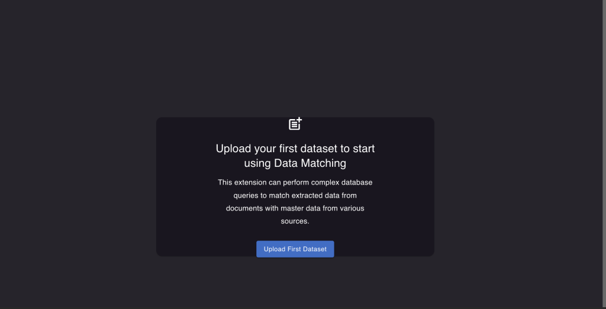
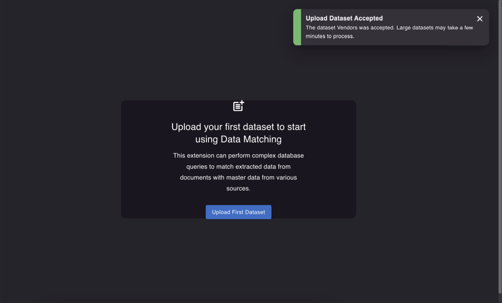
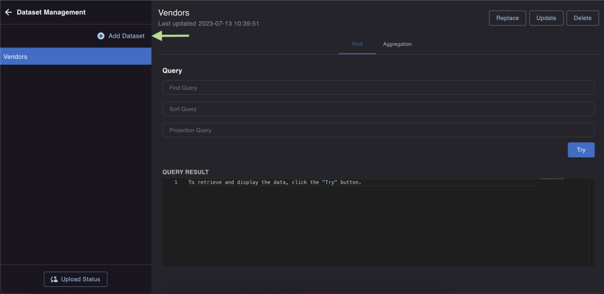
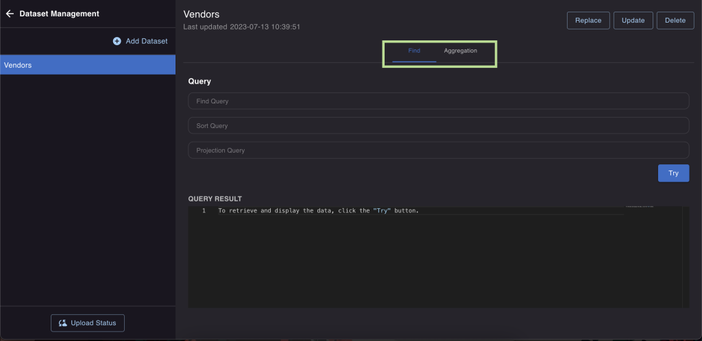

# Dataset management

## How to prepare your dataset

Having high-quality master data is crucial for successful data matching. This means for example a solid list of vendors that includes all the necessary information like addresses, secondary names, and country of origins. The more data you have, the better the results will be because the matching logic can be tailored to each specific dataset.

## How to upload your first dataset

To upload your first dataset while the extension is active, follow these steps:

1. Go to "Dataset Management."


2. Click on "Upload your first dataset."



3. Choose a name for your dataset and select the file you want to upload and click on the "Upload" button.


Here you can also ask the extension to automatically detect the format of the uploaded file. If the option is not selected a standard file format is assumed (the first line of CSV and XLSX files is used as a header, the expected CSV delimiter is a semicolon, line terminator is `\r\n`, quote character is a double quote.)

If everything is done correctly, you will see a success message. Please note that dataset uploads are asynchronous, which means they won't happen instantly.



In the bottom left corner of the screen, you'll find an "Upload status" button. Clicking on it will show you the progress of the dataset upload. Once the upload is finished, refresh the page to see the dataset listed in the left column.


To add another dataset, simply click on the "Add dataset" button. This allows you to include multiple datasets for matching purposes.



## How to manage your dataset

Once you've uploaded the dataset, you have options to update it, replace it, or even remove it entirely. Moreover, you can also try out queries on the dataset you've uploaded.

### Replace, update or delete the dataset

#### Replace the dataset

This action erases all the information in the dataset and fills it with the new information you provide. If you set an optional attribute "Replace by keys" (where "keys" means an attribute or set of attributes that identifies one or more records in the dataset), it will update entries with matching keys, removes entries that aren't in the new dataset, and adds any new entries.

:::note[Example]

Let's say we have some data already in the dataset - like `{"id" : 1, "name" : "Rossum"}` and `{"id" : 3, "name" : "Rossum UK"}`. Now, the data in the file we're uploading is `{"id" : 1, "name" : "Rossum LTD"}` and `{"id" : 2, "name" : "Rossum Prague"}`.

If we choose to "Replace by keys" using the "id" as the key, after replacing the dataset, we'll end up with `{"id" : 1, "name" : "Rossum LTD"}` and `{"id" : 2, "name" : "Rossum Prague"}`. This happens because the entry with `"id":1` gets updated, the one with `"id":2` is entirely new and gets added, and the entry with `"id":3` is removed since it's not in the new dataset.

:::

#### Update the dataset

For this process to work, you need to set the "Update by keys" parameter (where "keys" means an attribute or set of attributes that identifies one or more records in the dataset). These keys should be unique and make each entry distinguishable. It will update the entries with matching keys and add new entries without matching keys. Everything else that's already there in the dataset stays unchanged.

:::note[Example]

The dataset already contains these records: `[{"id" : 1, "name" : "Rossum"}, {"id" : 3, "name" : "Rossum UK"}]`. And in the uploaded file, you'll find these records: `[{"id" : 1, "name" : "Rossum LTD"}, {"id" : 2, "name" : "Rossum Prague"}]`.

By choosing to "Update by keys" with the key being "id", and then updating the dataset, the outcome will be: `[{"id" : 1, "name" : "Rossum LTD"}, {"id" : 2, "name" : "Rossum Prague"}, {"id" : 3, "name" : "Rossum UK"}]`. This is because the entry with `"id":1` gets updated, the one with `"id":2` is totally new and gets added, and the entry with `"id":3` remains in the dataset since the update process doesn't remove records.

:::

#### Delete

That option is going to remove uploaded dataset.


### Testing your queries on uploaded dataset

The "Dataset Management" tab lets you test your queries on the uploaded dataset. When you want to find specific data, you have two options: basic find and aggregation pipeline:



#### Basic find

It is a straightforward way to search for data. You can learn more about it [here](https://www.mongodb.com/docs/manual/reference/method/db.collection.find/).

:::note[Example]

Finding a vendor record using the extracted vendor VAT number:

```json
{ "vatNumber": "{sender_vat}" }
```

The left side, labeled as `vatNumber`, represents the attribute in the dataset. On the right side `"{sender_vat}"`, points to a specific ID (schema ID) of the field which value was extracted from the document that the data matching is performed for. During the matching process, `"{sender_vat}"` gets replaced with the actual value stored in the `sender_vat` data point from that document. Imagine we have `sender_vat = "CZ123456"`. In that case, the query would change to `{"vatNumber": "CZ123456"}` (which means `"vatNumber"=="CZ123456"`).

You can create many expressions like this. They will be logically connected using the AND operator into a single requirement. For instance: `{"vatNumber": "{sender_vat}", "country": "{sender_country}"}` would mean both `"vatNumber"` should match `"{sender_vat}"` and `"country"` should match `"{sender_country}"`.

:::

#### Aggregation pipeline

It is a more powerful method for searching and organising the data. You can read about it [here](https://www.mongodb.com/docs/manual/reference/method/db.collection.aggregate/).

You can't always be sure that a VAT number will be present on every document. However, it is a good approach to start by attempting to match vendors using a dependable identifier, such as the VAT number. In situations where the VAT number is missing, you might have to use a method called fuzzy matching to locate the right vendor.

To perform a fuzzy search, `$search` stage needs to be called inside the aggregate pipeline.

:::note[Example]

Finding a vendor record by looking for extracted Sender Name in the dataset:

```json
[
  {
    "$search": {
      "text": {
        "path": ["companyName"],
        "query": ["{sender_name}"],
        "fuzzy": {
          "maxEdits": 1
        }
      }
    }
  },
  {
    "$limit": 3
  },
  {
    "$project": {
      "companyName": 1,
      "internalId": 1,
      "email": 1
    }
  }
]
```

The search checks for `{sender_name}` in the `companyName` field of the dataset. It gives back all the matches, arranged by score starting from the highest (which is probably the best match) and going down. It is good practice to use the `$limit` stage to only get the top X results of this fuzzy matching. Use the `$project` stage to reduce data traffic and speed up the matching - it makes sure that only the listed `{key}: 1` are returned by the query.

You can utilise both of these techniques in the user interface. Just type your query and hit the "Try" button. This will display the top ten results that match your search.

:::

To learn more about the Master Data Hub configuration visit [Configuration Examples](./configuration-examples.md).
