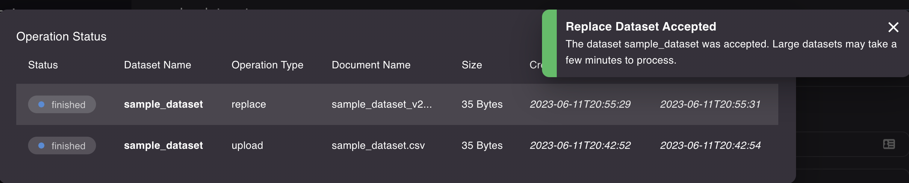

# Full dataset replace

This page describes a procedure for full replacement (the old data is fully replaced by the content of uploaded file) of the data in Master Data Hub dataset using file upload and the web UI.

## Prerequisites

1. File containing the full new data of the dataset.
1. User of Rossum organisation to which the dataset belongs to.
   1. The user has to have the Administrator role assigned.

## Dataset replacement procedure

:::warning

Please be aware the datasets in the Master Data Hub are usually part of the business logic configured in the Rossum system and changes in the datasets **might lead to errors or even block processing of the documents in Rossum**. The structure of the data (list of columns) should not be changed by the replacement unless discussed with the owner of the Data Matching configuration.

:::

First, login into Rossum application.

To open Master Data Hub, use direct URL to the dataset management:

- Rossum EU: https://elis.rossum.ai/svc/master-data-hub/web/management
- Rossum US: https://us.app.rossum.ai/svc/master-data-hub/web/management

You can alternatively navigate to the Extensions tab in Rossum, pick any Master Data Hub extension and click on the Dataset Management button to reach this page:

In the list of datasets on the left side select the dataset you want to replace and click the "Replace" button in the top right part of the window.

Click "Choose file" and select the file from location on your computer or drag and drop the file directly to the window:

Rossum is automatically interpreting the file and detects the header column. If the header is missing, an alphabetical keys are generated for the columns. If you run into problems, consider turning off the dynamic mode by unchecking the checkbox.

Click the "Replace" button to replace the dataset (the "Replace" button in the bottom right corner of the dialog becomes available after the file is chosen).

The replacement operation was started. You can check its status by clicking on the "Upload Status" button in the bottom left part of the main window. The dataset was replaced when the `replace` operation status is `finished`.

