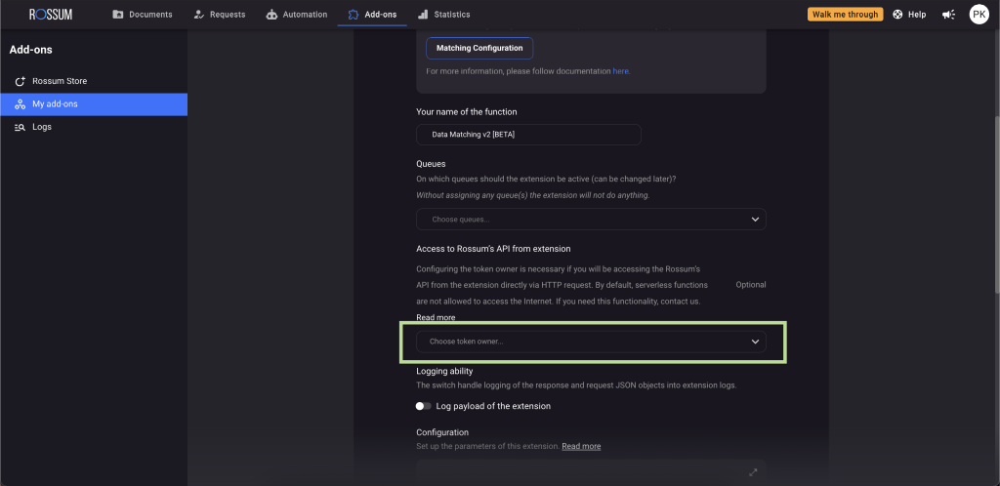

:::info[API documentation]

Master Data Hub: 👉 https://elis.rossum.ai/svc/master-data-hub/api/docs

Data Matching: 👉 https://elis.rossum.ai/svc/data-matching/api/docs
:::

## What is the Master Data Hub extension

Master Data Hub is like having a helpful assistant that can match important information from your documents, such as vendor names, customer names, addresses, and payment details, with the data you already have in your system or database.

Let's say you receive invoices from different vendors. With Master Data Hub, you can make sure that you only process invoices from vendors that are already in your database (ERP system). It can also help you find the right purchase order connected to an invoice and matches individual items listed on the invoice.

You can easily upload your own data in different formats - supported are `.json`, `.xml`, `.csv`, or `.xlsx` and use advanced searching to match the information extracted from your documents with the uploaded data. It opens up a whole new world of possibilities for accurate data matching!

## How to enable the Master Data Hub extension

### Step 1: Prepare your queues and schemas

To get started, you can begin by identifying the queues that contain the documents requiring this extension. Once identified, the next step is to set up a matching field. This field is a part of your schema and can be found on the validation screen. It displays the identified match or a message if no match is found.

Setting up a matching field is a one-time process per queue. You simply need to add the field in the "Fields to capture" section of the relevant queue settings. You have the flexibility to define the "Label" and unique "ID" for the field according to your preferences. The field must be an enum, as shown in the example below:

```json
{
  "rir_field_names": [],
  "constraints": {
    "required": false
  },
  "default_value": null,
  "category": "datapoint",
  "id": "vendor_match",
  "label": "Vendor ID",
  "type": "enum",
  "options": []
}
```


**Pro Tip**: If you want to use the result of one data matching configuration, in a query of a different matching configuration, and the data type of the subsequent query attribute is a number, you can specify `"enum_value_type" : "number"` attribute in the queue schema.

Real-life example: In the first query, you find a vendor using their VAT ID and get back vendor ID, which is a number. In the following query, you want to find all purchase orders linked to that vendor using the vendor ID. Now, since Rossum keeps all information as strings, you can guide the data matching process to treat the vendor ID as a number by using `"enum_value_type": "number"`. This ensures that the vendor ID from the annotation data is converted to a number before using it in the query to gather the purchase orders.

### Step 2: Activate the Master Data Hub extension in the Rossum Store

To activate the extension, follow these steps in the Rossum application:

1. Click on the "Add-ons" tab at the top of the app
1. Choose the "Rossum store" option to access all available extensions
1. Select the "Data matching v2" extension
1. Click on "Try extension"


### Step 3: Specify the queues to which you want to add the extension

To configure the extension, navigate to the "Rossum Store Extension Settings" and scroll down until you find the "Queues" section. In this section, you can select the specific queues where you want to use the extension.

Once the extension is activated for a queue, it will be automatically triggered whenever a new document is added to the queue or if a user makes changes to a value specified in any of the matching rules.


### Step 4: Assign the token owner (optional)

For our clients, this step is not necessary. An account with admin rights will be able to create the extension, and the owner of the extension will automatically be assigned to the account that created it. Therefore, this step is not displayed in the User Interface.  
⚠️ However, if you plan to use a different account later, please ensure that you create the extension with that account, or contact our Support team to reassign ownership, for example, to a special technical user.

For Rossum Employees: Token owner must have an "Admin" role assigned in Rossum. User queries the database and adds the results to annotation data.



### Step 5: Save the configuration

Once you have made your selections, don't forget to save your changes to ensure they take effect properly.
