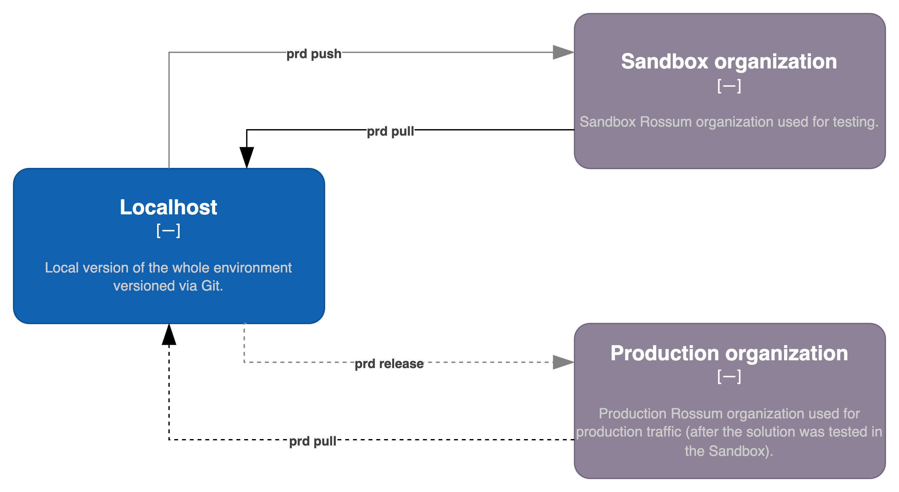

# Deployment patterns

Each company has its own deployment pattern. The most common ones (supported by Rossum Sandboxing tool) are:

## Single environment for sandbox and production

This is the simplest pattern for companies who do not have the need for separate sandbox environment.


To start using this patten, simply initialize a new project in some empty directory using the following command:

```bash
prd init
```

This command will create a new `credentials.json` file. Fill in your username and password for `source` (you can leave `target` section as is for this simple setup):

```json
{
  "source": {
    "api_base": "https://api.elis.rossum.ai/v1",
    "username": "CHANGE ME",
    "password": "CHANGE ME"
  },
  "use_same_org_as_target": true,
  "target": {
    "api_base": "...",
    "username": "...",
    "password": "..."
  }
}
```

Now you can pull (and eventually commit into Git) your whole organization configuration:

```bash
prd pull
```

Once you commit this initial version to Git, you can update any configuration and deploy it to the same organization using the following command:

```bash
prd push
```

## Two environments for sandbox and production

A bit more advanced setup with two environments: sandbox and production. Typically, the solution is first deployed to the sandbox organization (`source`) and once tested, released to production (`target`).



To use this pattern, follow the same steps as outlined in the [Simple environment example](#single-environment-for-sandbox-and-production) and first init your local repository:

```bash
prd init
```

However, now setup both `source` and `target` organizations. Notice that `use_same_org_as_target` is now set to false:

```json
{
  "source": {
    "api_base": "https://api.elis.rossum.ai/v1",
    "username": "CHANGE ME",
    "password": "CHANGE ME"
  },
  "use_same_org_as_target": false,
  "target": {
    "api_base": "https://api.elis.rossum.ai/v1",
    "username": "CHANGE ME",
    "password": "CHANGE ME"
  }
}
```

To push local changes to the sandbox, run `push` command:

```bash
prd push
```

And to release changes to production, run `release` command:

```bash
prd release
```

The local repository should always contain both `source` and `target` organization configurations. They can both be updated by calling `prd pull` command. You can also run `prd pull source` or `prd pull target` to update only one.

## Three environments for sandbox, UAT, and production

Finally, the most complex pattern with three environments: sandbox, UAT, and production. In this scenario, several environments are chained one after the other.


For sandbox and UAT environment configurations, see the [Two environments example](#two-environments-for-sandbox-and-production).

To configure the remaining production environment, it is necessary create a new Git branch and maintain there the configuration (from UAT to Production). Alternatively, for better transparency, create a new folder to store this configuration. This is necessary because `prd` currently doesn't support multi-target configurations out of the box.
