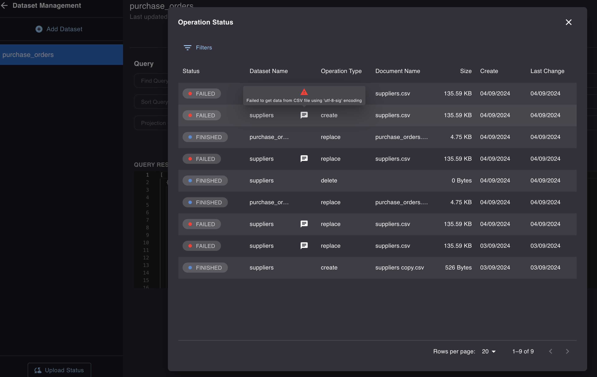

import WIP from '../\_wip.md';

## Installation

<WIP />

## Basic usage

<WIP />

## Available configuration options

Available configuration options are described in the API documentation:
- Import: [Scheduled Imports - File storage](https://elis.rossum.ai/svc/scheduled-imports/api/docs#tag/File-Storage/operation/import_dataset_from_file_storage_api_file_storage_v1_dataset_import_post)
- Export: [File Storage Export](https://elis.rossum.ai/svc/file-storage-export/api/docs)

## Logging and observability

### Extensions Logs

- URL `https://[org].rossum.app/settings/extensions/logs`
- The import job is not triggered directly, but using scheduler. Thus successfull record (type `INFO`) in the Extensions Logs does not necessary means the downstream import job was sucessfull, but it is a good start for observation

### Master Data Hub 
- URL: `https://[org].rossum.app/svc/master-data-hub/web/management`
- Directly in the MDH, there is a status screen "Upload Status", regardless of the origin of "upload".
- There is also note with the more detailed info in case of some error.

