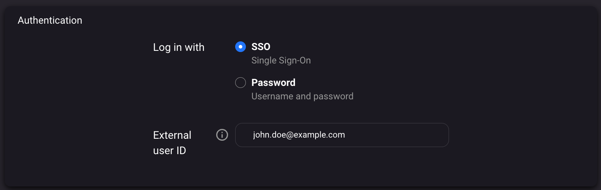
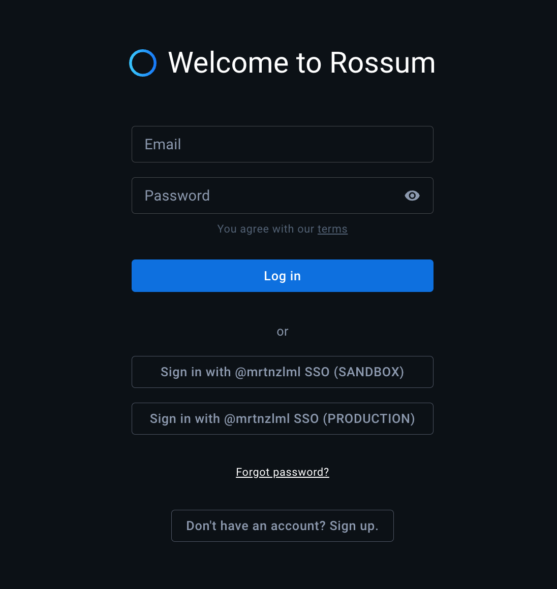

import PaidFeature from '../\_paid_feature.md';
import RossumInternalOnly from '../\_rossum_internal_only.md';

# Single Sign-On (SSO)

<PaidFeature />

## Creating users with SSO

When the SSO is configured, all newly created users are created with SSO enabled by default. Follow these steps:

1. Go to the user's profile and click on **Settings**.
1. Click **Add user**
1. Fill in all the required users and click **Add user** button

It might be necessary is to update the **External user ID** so that it matches the 3rd party system. However, by default, we use the same email address and the user might be able to log in without any changes needed.

## Changing existing users to SSO

When SSO is enabled on the organization, older users that were still using password-based login are not switched automatically. To change an existing user to SSO, you need to:

1. Contact Rossum.ai support to enable SSO for your account.
1. Go to the user's profile and click on **Settings**.
1. Find the relevant user and click on it.
1. In the user's profile, click on **Personal info**.
1. In the **Authentication** section, select **Log in with SSO**.

Note that if you do not see this section, it means that SSO is not enabled for your account.

The **External user ID** can be used to connect the user to your system (Azure, Google). It is a unique identifier that is used to match the user in your system with the user in Rossum.ai. In most cases, this ID is the same as user email.

For more technical information about SSO please visit our API reference: https://elis.rossum.ai/api/docs/#single-sign-on-sso

## Changing existing users back to password

Users with enabled SSO can be switched back to password based login following these steps:

1. Go to the user's profile and click on **Settings**.
1. Find the relevant user and click on it.
1. In the user's profile, click on **Personal info**.
1. In the **Authentication** section, select **Log in with Password**.

After saving the changes it is necessary to click on **Reset password** which will send an email with password reset link. This is necessary even when the user previously had a password but was switched to SSO! It is because when switching to SSO, we purge the passwords for security reasons.

## Using SSO on both sandbox and production

<RossumInternalOnly url="https://rossumai.atlassian.net/wiki/x/AQA6Uw" />

It is sometimes necessary to grant SSO access to the same user to both sandbox and production. Rossum, however, doesn't allow creating the same in multiple organizations (on the same cluster). Here is our recommended approach to work around this limitation:

1. Create unique users in both sandbox and production organizations. It is recommended to use their actual email addresses in production environment and add "+sandbox" suffix in sandbox environment (for example, test@example.com and test+sandbox@example.com).
1. In user settings, unify the "External user ID" values (claims). This value should be the same as the email used in the identity provider (so in sandbox remove the "+sandbox" suffix).
1. Ask your assigned account manager to create two "SSO providers" with the same frontend domain. This way, you'll be able to log in from one URL to both environments. Consider auto-provisioning in production.
1. Use this one domain to log in to sandbox or production via SSO. You can also log in via password for "break-glass" accounts.

Here is an example of how the login screen will look like:

